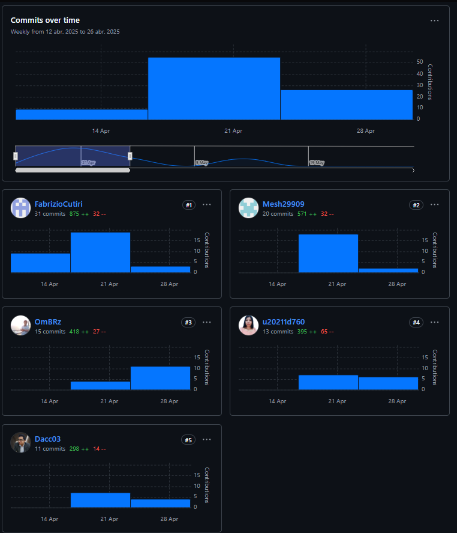
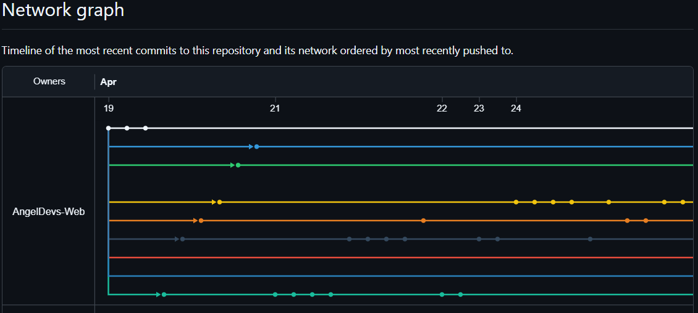
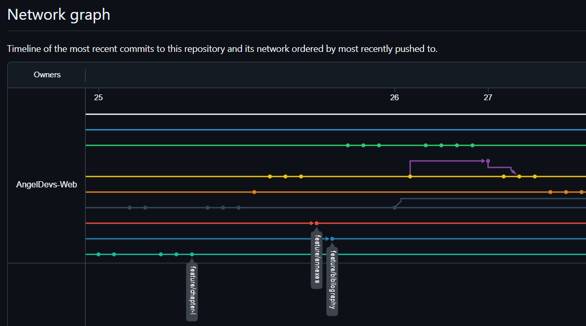
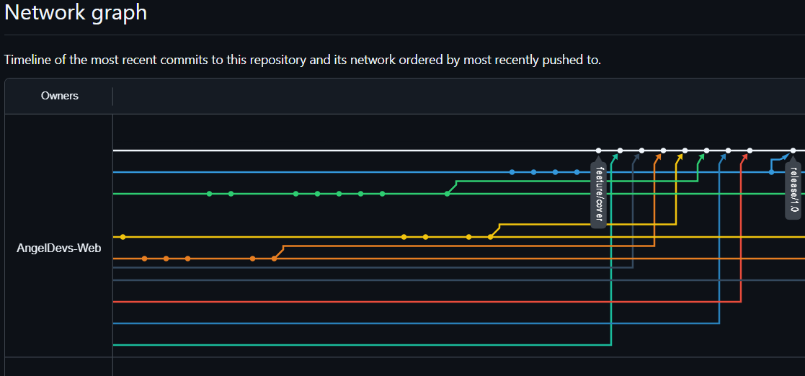
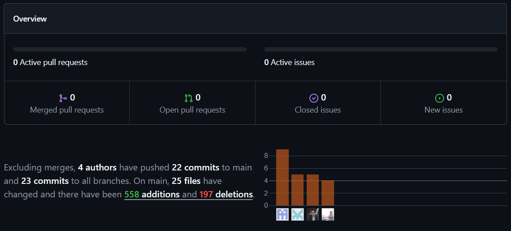
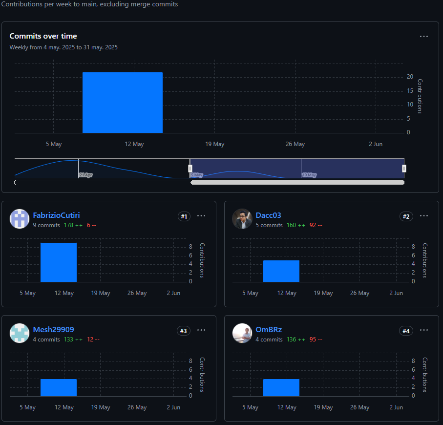
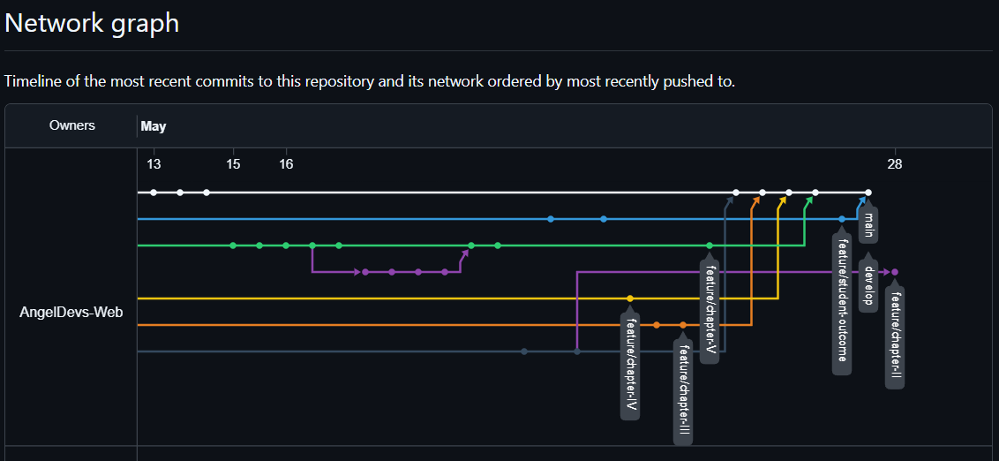

# Universidad Peruana de Ciencias Aplicadas

## Ingeniería de Software
## 1ASI0730 - Aplicaciones Web
### NRC: 4368
### Docente: Angel Augusto Velasquez Nuñez

## "Informe de Trabajo Final"
### Startup: AngelDevs
### Producto: Eventify

|            **Alumno**            | **Codigo** |
|:--------------------------------:|:----------:|
| Fabrizio Alexander Cutiri Agüero | U201914181 |
| Omar Christian Berrocal Ramirez  | U20201B529 |
|  Deybbi Anderson Crisanto Calle  | U202120569 |
|   July Zelmira Paico Calderon    | U20211D760 |
|     Jean Pierr Aldave Aldave     | U202120005 |

### Abril, 2025
## 2025-10

-----

## Registro de Versiones del Informe

| **Version** |      **Fecha**      |            **Autor**             |                                              **Descripción de modificación**                                              |
|:-----------:|:-------------------:|:--------------------------------:|:-------------------------------------------------------------------------------------------------------------------------:|
|     0.1     |     19/04/2024      | Fabrizio Alexander Cutiri Agüero |                                           Se presento la estructura del Informe                                           |
|     0.2     |     24/04/2024      | Fabrizio Alexander Cutiri Agüero |                        Se agrego Startup Profile, Antecedentes y Problematica, Segmentos Objetivo                         |
|     0.3     |     25/04/2024      | Fabrizio Alexander Cutiri Agüero |                                   Se agregarón todas las secciones del Lean UX Process                                    |
|     0.4     |     25/04/2024      | Fabrizio Alexander Cutiri Agüero |       Se agregaron las secciones respecto a las entrevistas, analisis de competidores y Artefactos del Needfinding        |
|     0.5     |     27/04/2024      | Fabrizio Alexander Cutiri Agüero |                       Se agregó el To Be Scenary Map, las Epics, User Stories y Technical Stories.                        |
|     0.6     |     27/04/2024      | Fabrizio Alexander Cutiri Agüero |                  Se agregaron los Style Guidelines generales y Web. Ademas del Information Architecture                   |
|     0.7     |     27/04/2024      | Fabrizio Alexander Cutiri Agüero |               Se agregarón wireframes, mockups del landing page y la aplicación web. Además del Prototipo.                |
|     0.8     |     27/04/2024      | Fabrizio Alexander Cutiri Agüero |                                   Se agregó el c4 model y el diagrama de base de datos.                                   |
|     1.0     |     27/04/2024      | Fabrizio Alexander Cutiri Agüero |                              Se realizó el Sprint plannig 1 y el despliegue del Landing Page                              |
|     1.1     |     13/05/2024      | Fabrizio Alexander Cutiri Agüero |                                 Se realizó el Product Backlog e Impact Mapping faltantes                                  |
|     1.2     |     15/05/2024      | Fabrizio Alexander Cutiri Agüero | Se realizaron las secciones Development Evidence y Execution Evidence de la funcionalidad Quote Management en el Sprint 2 |
|     1.3     |     16/05/2024      | Fabrizio Alexander Cutiri Agüero |                                              Se agregó el Sprint Planning 2                                               |
|     1.4     |     16/05/2024      | Fabrizio Alexander Cutiri Agüero | Se realizaron las secciones Development Evidence y Execution Evidence de la funcionalidad Task Management en el Sprint 2  |
|     1.5     |     16/05/2024      | Fabrizio Alexander Cutiri Agüero |                                 Se agregó la sección Deployment Evidence para el Sprint 2                                 |
|     1.6     |     16/05/2024      | Fabrizio Alexander Cutiri Agüero |                             Se agregó la sección Team Collaboration Insights para el Sprint 2                             |
|     1.7     |     16/05/2024      | Fabrizio Alexander Cutiri Agüero |                                        Se corrigió la sección Ubiquitous language                                         |
|     1.8     |     16/05/2024      | Fabrizio Alexander Cutiri Agüero |                    Se agregarón las secciones faltantes de Diagrama de clases y Diccionario de clases                     |
|     2.0     |     16/05/2024      | Fabrizio Alexander Cutiri Agüero |                                       Se actulizó el contenido del Student Outcome                                        |

## Project Report Collaboration Insights

**Link de la organización:** https://github.com/AngelDevs-Web

**Link del Repositorio del Informe:** https://github.com/AngelDevs-Web/eventify-project-report

### Reporte de Colaboración para la entrega del TB1

En esta primera entrega se redactó el informe hasta la sección Sprint 1 del capítulo V. Durante este proceso se realizaron diversas actividades, siendo las más relevantes:  la definición de los antecedentes y problematicas identificados, la implementación del Lean UX Canvas, analisis de competidores, diseño y analisis de entrevistas, creación de artefactos (User Personas, Task Matrix, etc), redacción de User Stories, diseño de Wireframes y MockUps para los productos (landing page y applicación web), diseño de los diagramas C4 Model (Contexto, Contenedores y Componentes), asi como la documentación de la implementación y despliegue del landing page.

Para evidenciar nuestros avances y que todos los miembros del equipo participaron en la redacción del informe, se presenta a continuación, las capturas obtenidas de los analíticos de colaboración en el repositorio de GitHub del Informe:

**Contributors**

En el analítico de Contributors, se evidencia las contribuciones que hizo cada integrante del equipo para la redacción del informe durante el periodo de esta primera entrega. Se puede observar la cantidad de commits que realizó cada integrante, asi como la cantidad de addiciones y eliminaciones que se realizaron en el informe.

**Network Graph**

En el analítico de **Network Graph**, se evidencia que se trabajo con GitFlow para la redacción del informe. Se puede apreciar las diversas ramas que se crearon para cada feature que presentaba el informe. Se crearon ramas tanto para los capitulos, como para la caratula del informe, el Student Outcome, los anexos y las referencias bibliográficas. Se realizaron commits en cada una de estas ramas, para posteriormente hacer **merge** hacia la rama develop, crear una nueva rama release 1.0 y finalmente hacer merge a la rama main.

### Reporte de Colaboración para la entrega del TP1

En esta segunda entrega se elaboró la sección correspondiente al Sprint 2 del capítulo V, asi como correcciones de secciones pasadas, tales como el User Task Matrix, Product Backlog, diagrama de clases, diccionario de clases y ubiquitous language. Durante este proceso, se llevaron a cabo reuniones para definir el sprint goal y se distribuyeron las tareas necesarias para la implementación y el despliegue del frontend. Además, en lo que respecta al contenido del Sprint 2, se redactaron el Sprint Planning y las evidencias de desarrollo, ejecución, despliegue y colaboración asociadas a las principales funcionalidades del frontend trabajadas durante este periodo.

Para evidenciar nuestros avances y que todos los miembros del equipo participaron en la redacción del informe, se presenta a continuación, las capturas obtenidas de los analíticos de colaboración en el repositorio de GitHub del Informe:

**Pulse**

En el analítico de **Pulse** se evidencian los commits que realizó cada integrante del equipo durante el periodo definido para esta segunda entrega.

**Contributors**

En el analítico de Contributors, se evidencia las contribuciones que hizo cada integrante del equipo para la redacción del informe. Se puede observar la cantidad de commits que realizó cada integrante, asi como la cantidad de addiciones y eliminaciones que se realizaron en el informe.

**Network Graph**

En el analítico de **Network Graph**, se evidencia que se ha trabajado en ramas de capitulos anteriores al Sprint 2, las cuales son correcciones realizadas sobre errores identificados en la entrega anterior. Además de esto, tambien se trabajo en la rama del Capitulo V, para redactar la documentación relacionada a la implementación y despliegue del frontend durante el Sprint 2.

### Reporte de Colaboración para la entrega del TB2

**Pulse**

**Contributors**

**Network Graph**

------

# Contenido

## [Student Outcome](#ingeniería-de-software)
## [Capítulo I: Introducción]()
* ### [1.1. Startup Profile]()
    * #### [1.1.1. Descripción de la Startup]()
    * #### [1.1.2. Perfiles de integrantes del equipo]()
* ### [1.2. Solution Profile]()
    * #### [1.2.1. Antecendentes y Problemática]()
    * #### [1.2.2. Lean UX Process]()
        * ##### [1.2.2.1. Lean UX Problem Statements]()
        * ##### [1.2.2.2. Lean UX Assumptions]()
        * ##### [1.2.2.3. Lean UX Hypothesis Statements]()
        * ##### [1.2.2.4. Lean UX Canvas]()
* ### [1.3. Segmentos objetivo]()

## [Capítulo II: Requirements Elicitation & Analysis]()
* ### [2.1. Competidores]()
    * #### [2.1.1. Análisis competitivo]()
    * #### [2.1.2. Estrategias y tácticas frente a competidores]()
* ### [2.2. Entrevistas]()
    * #### [2.2.1. Diseño de entrevistas]()
    * #### [2.2.2. Registro de entrevistas]()
    * #### [2.2.3. Análisis de entrevistas]()
* ### [2.3. Needfinding]()
    * #### [2.3.1. User Personas]()
    * #### [2.3.2. User Task Matrix]()
    * #### [2.3.3. User Journey Mapping]()
    * #### [2.3.4. Empathy Mapping]()
    * #### [2.3.5. As-Is Scenario Mapping]()
* ### [2.4. Ubiquitous Language]()

## [Capítulo III: Requirements Specification]()
* ### [3.1. To-Be Scenario Mapping]()
* ### [3.2. User Stories]()
* ### [3.3. Impact Mapping]()
* ### [3.4. Product Backlog]()

## [Capítulo IV: Product Design]()
* ### [4.1. Style Guidelines]()
    * #### [4.1.1. General Style Guidelines]()
    * #### [4.1.2. Web Style Guidelines]()
* ### [4.2. Information Architecture]()
    * #### [4.2.1. Organization System]()
    * #### [4.2.2. Labeling System]()
    * #### [4.2.3. SEO Tags and Meta Tags]()
    * #### [4.2.4. Searching System]()
    * #### [4.2.5. Navigation System]()
* ### [4.3. Landing Page UI Design]()
    * #### [4.3.1. Landing Page Wireframe]()
    * #### [4.3.2. Landing Page Mock-up]()
* ### [4.4. Web Applications UX/UI Design]()
    * #### [4.4.1. Web Applications Wireframe]()
    * #### [4.4.2. Web Applications Wireflow Diagrams]()
    * #### [4.4.3. Web Applications Mock-ups]()
    * #### [4.4.4. Web Applications User Flow Diagrams]()
* ### [4.5. Web Applications Prototyping]()
* ### [4.6. Domain-Driven Software Architecture]()
    * #### [4.6.1. Software Architecture Context Diagram]()
    * #### [4.6.2. Software Architecture Container Diagram]()
    * #### [4.6.3. Software Architecture Components Diagram]()
* ### [4.7. Software Object-Oriented Design]()
    * #### [4.7.1. Class Diagrams]()
    * #### [4.7.2. Class Dictionary]()
* ### [4.8. Database Design]()
    * #### [4.8.1. Database Diagram]()

## [Capítulo V: Product Implementation, Validation & Deployment]()
* ### [5.1. Software Configuration Management]()
    * #### [5.1.1. Software Development Environment Configuration]()
    * #### [5.1.2. Source Code Management]()
    * #### [5.1.3. Source Code Style Guide & Conventions]()
    * #### [5.1.4. Software Deployment Configuration]()
* ### [5.2. Landing Page, Services & Applications Implementation]()
    * #### [5.2.1. Sprint 1]()
        * ##### [5.2.1.1. Sprint Planning 1]()
        * ##### [5.2.1.2. Aspect Leaders and Collaborators]()
        * ##### [5.2.1.3. Sprint Backlog 1]()
        * ##### [5.2.1.4. Development Evidence for Sprint Review]()
        * ##### [5.2.1.5. Execution Evidence for Sprint Review]()
        * ##### [5.2.1.6. Services Documentation Evidence for Sprint Review]()
        * ##### [5.2.1.7. Software Deployment Evidence for Sprint Review]()
        * ##### [5.2.1.8. Team Collaboration Insights during Sprint]()

## [Conclusiones]()
## [Bibliografía]()
## [Anexos]()