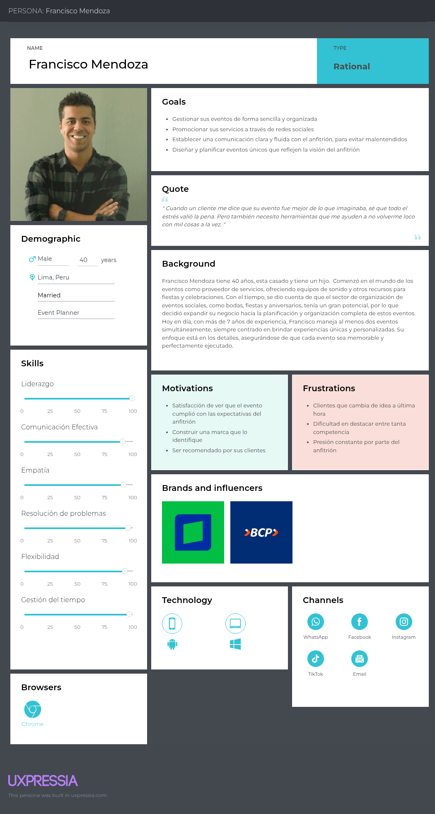

# Capítulo II: Requirements Elicitation & Analysis

## 2.1. Competidores

### 2.1.1. Análisis competitivo

<table border="1px">
        <thead>
            <th colspan="11">Competitive Analysis Landscepe</th>
        </thead>
        <tbody>
            <tr>
                <td rowspan="2" colspan="2">¿Por qué llevar a
                    cabo este análisis?</td>
                <td colspan="9">Escriba en el recuadro la pregunta que busca responder o el objetivo de
                    este análisis.</td>
            </tr>
            <tr>
                <td colspan="9">El objetivo de este análisis es comprender el funcionamiento y las características que presentan los productos de nuestros competidores, para posteriormente planificar estrategias y tácticas para aprovechar las fortalezas de nuestro producto y las debilidades de nuestros competidores.   </td> 
            </tr>
            <tr>
                <tr>
                    <td colspan="3">(En la cabecera colocar por cada competidor nombre y logo)</td>
                    <td colspan="2">Eventify</td>
                    <td colspan="2"> Bizzabo</td>
                    <td colspan="2"> PartySlate</td>
                    <td colspan="2"> Eventective</td>
                </tr>
            </tr>
            <tr>
                <td rowspan="2" colspan="1">Perfil</td>
                <td colspan="2">Overview</td>
                <td colspan="2">Plataforma que brinda herramientas de gestion para organizadores y los conecta con anfitriones que desean contratar sus servicios</td>
                <td colspan="2">Plataforma para la gestión de eventos corporativos, especializada en conferencias y experiencias presenciales, virtuales e híbridas </td>
                <td colspan="2">Plataforma donde organizadores de eventos pueden publicar sus servicios mediante portafolios visuales para atraer la atención de los anfitriones que buscan sus servicios.</td>
                <td colspan="2">Plataforma para buscar y contratar proveedores de servicios para eventos (locales, catering, etc.)</td>
            </tr>
            <tr>
                <td colspan="2"> Ventaja competitiva    ¿Qué valor ofrece a los clientes?</td>
                <td colspan="2">Los organizadores tienen herramientas que facilitan la gestion de eventos. Mientras que los anfitriones pueden encontrar, cotizar y analizar distintas propuestas desde un mismo lugar.</td>
                <td colspan="2">Permite crear y gestionar eventos(presencial, virtual o hibrido). Además presenta sección de networking para cada evento, permitiendo a los participantes interactuar entre ellos. </td>
                <td colspan="2">Ofrece a los organizadores presentar sus servicios mediante experiencias visuales basadas en portafolios de fotos y videos de eventos anteriores.</td>
                <td colspan="2">Ofrece facilidad para encontrar servicios para eventos (locales, catering, etc.), gracias a su amplia variedad de proveedores</td>
            </tr>
            <tr>
                <td rowspan="2" colspan="1">Perfil de Marketing</td>
                <td colspan="2">Mercado Objetivo</td>
                <td colspan="2">Organizadores de eventos y anfitriones ubicados en Lima, Perú</td>
                <td colspan="2">Empresas medianas y grandes que organizan conferencias, cumbres o lanzamientos de productos</td>
                <td colspan="2">Organizadores de eventos, proveedores (catering, musica, fotografos, etc.) y anfitriones, mayormente de EE.UU.</td>
                <td colspan="2">Proveedores de servicios para eventos (locales, catering, etc) y anfitriones que desean contratar sus servicios en EE.UU. y Canada</td>
            </tr>
            <tr>
                <td colspan="2">Estrategia de Marketing</td>
                <td colspan="2">Posicionamiento del Landing page del producto.   Campañas en Google Ads.   Publicidad en redes sociales.  Colaboración con organizadores de eventos</td>
                <td colspan="2">Posicionamiento del Landing page del producto.   Publicidad en redes sociales.   Organización de eventos propios para mostrar las caracteristicas de su plataforma</td>
                <td colspan="2">Publicidad en redes sociales    Posicionamiento de su plataforma</td>
                <td colspan="2">Publicidad en redes sociales    Posicionamiento de su plataforma</td>
            </tr>
            <tr>
                <td rowspan="3" colspan="1">Perfil de Producto</td>
                <td colspan="2">Producto & Servicio</td>
                <td colspan="2">Es una aplicación web que conecta a organizadores de eventos con anfitriones que necesitan contratar sus servicios. Además, ofrece herramientas para los organizadores, como calendarios de eventos, notas internas, comunicación directa con los anfitriones, entre otros.  </td>
                <td colspan="2">Es una aplicación web y movil que ofrece herramientas para gestion de eventos como registro de asistentes, gestión de entradas, networking y analiticas en tiempo real </td>
                <td colspan="2">Es una aplicación web que ofrece servicios de organizadores de eventos mediante portafolios visuales </td>
                <td colspan="2">Es una aplicación web que permite realizar busquedas de servicios de proveedores para eventos, como locales, catering, musica, etc.</td>
            </tr>
            <tr>
                <td colspan="2">Precio & Costos  </td>
                <td colspan="2">El registro a la aplicación sera de forma gratuita, sin embargo, para acceder a las herramientas de gestión, los organizadores deberan pagar una suscripción mensual.</td>
                <td colspan="2">La aplicación ofrece una tarifa de $17,999 por año</td>
                <td colspan="2">Publicación gratuida ilimitada y planes desde $195 a $695 mensuales para mayor visibilidad</td>
                <td colspan="2">Pago por leads o suscripción mensual de $100 a $170</td>
            </tr>
            <tr>
                <td colspan="2">Canales de distribucion (web y/o Movil)</td>
                <td colspan="2">Aplicación web</td>
                <td colspan="2">Aplicación web y Móvil</td>
                <td colspan="2">Aplicación web</td>
                <td colspan="2">Aplicación web</td>
            </tr>
            <tr>
                <td rowspan="5">Analisis SWOT</td>
                <td colspan="10">Realice esto para su startup y sus competidores. Sus fortalezas deberían apoyar sus
                    oportunidades y contribuir a lo que ustedes definen como su posible ventaja
                    competitiva</td>
            </tr>
            <tr>
                <td colspan="2">Fortalezas</td>
                <td colspan="2">Ofrecemos herramientas de gestión, como calendarios para organizar eventos, comunicación de organizadores y anfitriones</td>
                <td colspan="2"> Solución potente y robusta para eventos corporativos grandes. Además, se puede integrar con herramientas empresariales</td>
                <td colspan="2"> Permite a los organizadores y proveedores a crear portafolios visuales de sus servicios para captar la atención de los anfitriones</td>
                <td colspan="2"> Presenta una amplia variedad de proveedores registrados y es accesible para proveedores pequeños que inician en el rubro.</td>
            </tr>
            <tr>
                <td colspan="2">Debilidades</td>
                <td colspan="2">Nuestra aplicación es nueva en el mercado nacional, lo que podria complicar atraer nuevos usuarios</td>
                <td colspan="2">Es compleja y costosa para organizadores de eventos no masivos</td>
                <td colspan="2">Ofrece pocas opciones para el mercado nacional, ya que esta centrado mayormente para EE.UU. Además no ofrece herramientas de gestión</td>
                <td colspan="2">Presenta una interfaz muy simple y poco atractiva. Además, los servicios que ofrece solo estan disponibles en EE.UU. y Canada</td>
            </tr>
            <tr>
                <td colspan="2">Oportunidades</td>
                <td colspan="2">Es una solución escalable para nivel nacional e inclusive para todo latinoamerica.</td>
                <td colspan="2">Tiene la posibilidad de liderar el sector de eventos híbridos y virtuales, integrando tecnologías como IA para automatizar procesos de gestión.</td>
                <td colspan="2">Puede expandirse a nuevos países y fortalecer su red de organizadores mediante alianzas estratégicas</td>
                <td colspan="2">Puede mejorar su interfaz para dale mejor visibilidad a sus proveedores, además de integrar herramientas de gestión</td>
            </tr>
            <tr>
                <td colspan="2">Amenazas</td>
                <td colspan="2">Al ser una aplicación nueva, el exito depende tener una amplia cantidad de organizadores y anfitriones simultaneamente, ya que si hay poca oferta o demanda en la aplicación, los usuarios no tendrán motivos para permanecer activos.</td>
                <td colspan="2">La mayor parte de sus clientes son grandes empresas que requieren soluciones personalizadas. Si no cumplen con las expectativas, podrían perder contratos importantes </td>
                <td colspan="2">Competencia con redes sociales visuales, como Instragram</td>
                <td colspan="2">Puede quedar obsoleta frente a nuevas soluciones más modernas </td>
            </tr>
        </tbody>
    </table>

### 2.1.2. Estrategias y tácticas frente a competidores

**Estrategia de diferenciación:**
    
   - La estrategia de diferenciación se basa en ofrecer una solución de software única que se distinga de la competencia. En este caso, la propuesta es crear una aplicación web que conecte a organizadores de eventos con anfitriones, brindando herramientas de gestión para facilitar la planificación y ejecución de eventos. Esto permitirá a los organizadores optimizar su trabajo y a los anfitriones encontrar fácilmente el servicio que necesitan.
     

   * **Tácticas:**
   - Incluir funcionalidades como calendario, chat directo, cotizaciones, notas personalizadas y seguimiento por pasos.
   - Diseñar una interfaz intuitiva, clara y amigable desde el primer uso.

**Estrategia de liderazgo en costos:**
    
 - La estrategia de liderazgo en costos implica ofrecer una solución a un precio más bajo que la competencia. En este caso, se propone ofrecer una suscripción mensual asequible para los organizadores de eventos, lo que les permitirá acceder a herramientas de gestión sin incurrir en altos costos iniciales.
     

 * **Tácticas:**
  - Implementar un modelo freemium: registro gratuito y herramientas básicas sin costo.
  - Ofrecer una suscripción mensual accesible para funciones avanzadas, en contraste con los altos precios de aplicaciones como Bizzabo.
  - No cobrar comisiones por contratos gestionados dentro de la app.

**Estrategia de diferenciación enfocada:**
  
 - La propuesta se enfoca en atender a nichos específicos del mercado de eventos sociales (como cumpleaños, bodas y celebraciones familiares), evitando la complejidad de plataformas orientadas a eventos corporativos de gran escala.
     

 * **Tácticas:**
  - Simplificar las funcionalidades para que se adapten a las necesidades reales de los eventos sociales.
  - Ajustar la comunicación visual y verbal al tono cercano, emocional y personal que estos eventos suelen tener.

**Estrategias competitivas adicionales:**
    

 * **Tácticas:**
  - Permitir a los usuarios dejar reseñas y calificaciones de los organizadores.
  - Implementar notificaciones automáticas sobre el avance de cada evento (como recordatorios o pendientes).

**Estrategia de construcción de marca:**
    
 - Apostar por una identidad visual cálida, cercana y profesional, que conecte emocionalmente con el público objetivo y genere confianza.
     

 * **Tácticas:**
  - Desarrollar una identidad visual con colores amigables y un logo simple pero memorable.
  - Utilizar redes sociales como Instagram, TikTok y Facebook para mostrar casos reales de uso de la app (antes y después de eventos organizados con Eventify).
  - Fomentar una comunidad activa alrededor de la marca, compartiendo consejos y experiencias sobre organización de eventos.

## 2.2. Entrevistas

### 2.2.1. Diseño de entrevistas

Para el desarrollo de las entrevistas de los segmentos objetivos definidos, se redactaron las siguientes preguntas:
  

**Organizadores de eventos no masivos:**

**Preguntas Demográficas:**

* ¿Cuál es su nombre?
* ¿Qué edad tiene?
* ¿Como se definiría usando solo 3 adjetivos?
* ¿Cuál es su estado civil?
* ¿A qué se dedica? (freelance o como organización)
* ¿En qué distrito/provincia reside?
* ¿Hace cuánto tiempo lleva trabajando como organizador de eventos?
* ¿Porque decidió trabajar en el rubro de organizador de eventos?

**Preguntas de Hábitos Digitales:**

* Porque medio se comunica con sus clientes con mayor frecuencia (Whatsapp, Instagram, Facebook, correo Hotmail/Gmail)?
* ¿Con que dispositivo interactúa con mayor frecuencia (Pc, laptop, iPad)?
* ¿Cuál es el navegador web que con mayor frecuencia usa? (Chrome, Safari, Brave, Opera).

**Preguntas Principales:**

* ¿Qué tipo de eventos organiza con mayor frecuencia?
* ¿Cuántos eventos gestiona por mes (promedio)?
* ¿Qué diferencia nota de organizar un evento sencillo de uno complejo?
* ¿Cuál es el rango salarial para organizar un evento (quinceañero, boda, bautizo, etc.)?
* ¿Podría contarnos paso a paso, como es su proceso para organizar un evento, desde que un cliente lo contacta hasta el día del evento?
* ¿Como gestiona su planificación de eventos? ¿Utiliza alguna aplicación de calendario, agenda o recordatorio? ¿Alguna es de paga? ¿Si es así cuales y cuánto?

* ¿Qué desafíos encuentra al comunicarse con sus clientes?
* ¿Como ha logrado conseguir la mayoría de sus clientes, promocionándose en alguna red social, sitio web o por contactos? ¿Si es así cual y cómo?
* ¿Qué aspecto del trabajo considera que los clientes menos comprenden? ¿Hay términos técnicos en la organización de eventos?
* ¿Como gestiona el pago de sus eventos (cuotas, adelantos, al finalizar)?
* ¿Cuáles son los medios de pagos que utiliza con mayor frecuencia?
* ¿Cuáles son los factores (cantidad de invitados, temática, servicios, etc.) que considera para las cotizaciones de sus eventos con los clientes?
* ¿Qué le gustaría automatizar o simplificar de su trabajo?

**Preguntas Complementarias:**

* ¿Qué es lo que más valoran sus clientes en relación a sus servicios según su experiencia?
* ¿Qué es lo que más le frustra de trabajar como organizador de eventos en el ámbito de planificación? (Contratar servicios de terceros).
* ¿Ha tenido alguna experiencia mala con alguno cliente? ¿Como las resolvió?

  

**Anfitriones de Eventos**

**Preguntas Demográficas**

* ¿Cuál es su nombre?
* ¿Qué edad tiene?
* ¿Como se definiría usando solo 3 adjetivos?
* ¿Cuál es su estado civil?
* ¿A qué se dedicas?
* ¿En qué distrito/provincia reside?

**Preguntas de Hábitos Digitales**

* ¿Por medio de que navegador web contacto con el organizador?
* ¿Cuál es el dispositivo que utiliza con mayor frecuencia (laptop, Tablet, celular, computadora)?

**Preguntas Principales**

* ¿Alguna vez has contratado a algún organizador de eventos?
* ¿Cuál fue el último evento que contrato?
* ¿Con cuánto tiempo de anticipación comenzó a planearlo?
* ¿Como encontró al organizador de eventos? (Redes sociales, contactos, página web).
* ¿Qué factores considero para contratar a un organizador de eventos?
* ¿Solicito cotizaciones a diversos organizadores antes de decidir?
* ¿Hubo algo que le costó entender o comparar entre los diferentes servicios? ¿Si es así cuáles?
* ¿Cómo considera que fue la comunicación con el organizador y con qué frecuencia?
* ¿Por qué medios de comunicación fue la interacción con su organizador de eventos? (correo, WhatsApp).
* ¿Hubo algo que le hubiera gustado que le expliquen mejor?
* ¿Qué aspecto del evento le hubiera gustado mejorar? (DJ era malo, sillas en mal estado).
* ¿Como fue el proceso de cotización y pagos? ¿Porque medios fue realizado el pago?
* ¿Hubo algún gasto inesperado durante la planificación del evento? (Meseros extras).

**Preguntas Complementarias**

* ¿Recomendaría a otras personas contratar al mismo organizador de eventos?
* ¿Qué fue lo más satisfactorio de todo el proceso?
* Que fue lo mas frustrante/estresante de todo el proceso de planificación junto con su organizador?
* ¿Le pareció correcto el costo del evento?
* ¿Cuánto influye el costo en su decisión de contratación? (Prefiere pagar mas por calidad o busca opciones más económicas).
* ¿Sintió que entendieron bien su visión del evento con lo que organizaron?
* ¿Pudo hacer seguimiento al estado de pagos fácilmente?

### 2.2.2. Registro de entrevistas

A continuación, se presentará un resumen de cada entrevista realizada a los segmentos objetivo. Además, cada entrevista contará una captura de pantalla como evidencia y el intervalo de tiempo de duración que tienen en el video realizado, para que sea más sencillo ubicarlos.

  

**Segmento Objetivo: Anfitriones de Evento**
  

**Entrevista 1: John Rafael Cutiri Chinchay**

**Datos del entrevistado**
* **Nombre:** John Rafael Cutiri Chinchay
* **Edad:** 52 años
* **Estado civil:** Casado
* **Ocupación:** Comerciante
* **Distrito de Residencia:** Chorrillos

* **Duración de la entrevista:** [00:00:08 - 00:16:12]
* **Video de las entrevistas:** [Needfinding - Interviews](https://upcedupe-my.sharepoint.com/:v:/g/personal/u201914181_upc_edu_pe/EXks3gNtzrFPh8mlpqOnP4oBJkIS1VjexgiBtpRkFu_wow)

**Resumen de la entrevista:**

El entrevistado se llama John Rafael Cutiri Chinchay, es una persona sobria, directa y de pocas palabras. Actualmente se encuentra casado, reside en Chorrillos y trabaja como comerciante. El navegador que utiliza con frecuencia es Google Chrome y su dispositivo preferido es el celular.

Durante la entrevista, el señor John relató su experiencia al contratar a un organizador de eventos para la fiesta de quince años de su hija. La planificación del evento duró aproximadamente 10 meses. El entrevistado contrató a este organizador tras solicitar varias cotizaciones con diferentes proveedores, decidiendo contratar al organizador recomendado por un familiar, ya que le generaba mayor confianza y las propuestas que recibió eran muy similares. Además, se convenció al ver videos de eventos anteriores publicados por este organizador en redes sociales.

Durante la planificación, la comunicación con el organizador se limitó a la firma del contrato, pero se intensificó a medida que se acercaba la fecha del evento, utilizando WhatsApp como canal principal. Tambien, comento que lo mas estresante fue este periodo cercano al evento, ya que sentia presión por la posibilidad de que algo pudiera faltar.

Respecto al desarrollo del evento, un aspecto que le hubiera gustado que se explicara con mayor claridad fue el tema del volumen de la música. Esto debido a que el local se encontraba en una zona de condominios y no se le permitió aumentar el volumen para evitar molestias a los vecinos. También manifestó cierta insatisfacción con la atención a los invitados, ya que notó que algunas mesas eran atendidas mientras otras no, lo cual evidenciaba una posible falta de personal.

En cuanto al pago, se estableció un adelanto del 30% y el resto a cancelar el día del evento. No obstante, el entrevistado optó por realizar pagos periódicos para facilitar la gestión económica. Todos los pagos se efectuaron mediante transferencia bancaria y no se presentaron gastos imprevistos. Aunque no recibió boletas ni facturas, conservó las capturas de pantalla como comprobantes de pago.

A pesar de los inconvenientes, el entrevistado se mostró satisfecho con el resultado final. Consideró que el evento cumplió sus expectativas y que el organizador logró plasmar su visión. Asimismo, afirmó que no habría pagado más por un servicio de mayor calidad, ya que lo recibido le pareció adecuado. Finalmente, mencionó que recomendaría al organizador por haber cumplido con lo prometido.

**Entrevista 2: Cenith Luque García**

**Datos del entrevistado**
* **Nombre:** Cenith Luque García
* **Edad:** 39 años
* **Estado civil:** Casada
* **Ocupación:** Militar del ejército peruano
* **Distrito de Residencia:** Lima - Chorrillos

* **Duración de la entrevista:** [00:16:14 - 00:21:49]
* **Video de las entrevistas:** [Needfinding - Interviews](https://upcedupe-my.sharepoint.com/:v:/g/personal/u201914181_upc_edu_pe/EXks3gNtzrFPh8mlpqOnP4oBJkIS1VjexgiBtpRkFu_wow)

**Resumen de la entrevista:**

La entrevistada se llama Cenith Luque García. Se describe como una mujer comprometida y responsable, cualidades que considera fundamentales para el éxito en la organización de eventos. Durante la entrevista, compartió su experiencia al organizar un evento para el Ejército Peruano, específicamente un almuerzo conmemorativo por el 145 aniversario del arma de ingeniería. Actualmente, Cenith utiliza redes sociales como Facebook e Instagram para establecer contactos profesionales, lo cual le permitió comunicarse inicialmente con el cliente.

La planificación del evento se desarrolló con anticipación y requirió un trabajo constante de coordinación. Desde el inicio, la comunicación con el cliente se dio por mensajes, para luego pasar a reuniones presenciales con el objetivo de alinear expectativas y definir detalles. Uno de los temas que generó confusión fue el de la decoración, por lo que se necesitó mayor explicación para evitar malentendidos. Cenith resaltó la importancia de contar con una buena comunicación para que tanto el organizador como el cliente estén en sintonía.

En cuanto a los aspectos formales, se firmó un contrato que detallaba los servicios acordados, y los pagos se realizaron mediante transferencias bancarias. Este procedimiento, según la entrevistada, brindó seguridad a ambas partes. Además, se llevó un seguimiento ordenado de los pagos, lo cual contribuyó a generar confianza en el proceso.

Durante el desarrollo del evento, Cenith sintió cierta frustración por los tiempos de ejecución, ya que no se cumplieron tal como habían sido planeados. A pesar de ello, se mostró satisfecha con el resultado final, pues la organización comprendió correctamente la visión general del evento. Consideró que el costo fue razonable y que lo más importante era lograr una experiencia de calidad, sin enfocarse exclusivamente en el presupuesto.

Finalmente, la entrevistada afirmó que recomendaría al organizador del evento, destacando su profesionalismo y cumplimiento. También subrayó que una planificación adecuada, una comunicación constante y una buena gestión financiera son claves para llevar a cabo un evento exitoso.

**Entrevista 3: Anacristina Reymundo Mamani**

**Datos del entrevistado**
* **Nombre:** Anacristina Reymundo Mamani
* **Edad:** 22 años
* **Estado civil:** Soltera
* **Ocupación:** Estudiante de Medicina veterinaria
* **Distrito de Residencia:** Lima - Santiago de Surco

* **Duración de la entrevista:** [00:21:50 - 00:30:15]
* **Video de las entrevistas:** [Needfinding - Interviews](https://upcedupe-my.sharepoint.com/:v:/g/personal/u201914181_upc_edu_pe/EXks3gNtzrFPh8mlpqOnP4oBJkIS1VjexgiBtpRkFu_wow)

**Resumen de la entrevista:**

La entrevistada se llama Anacristina Reymundo Mamani. Es una joven de 22 años que se define como empática, responsable y proactiva. Es estudiante de Medicina Veterinaria y se encuentra soltera. Durante la entrevista, compartió su experiencia al organizar un evento familiar para celebrar los 80 años de su abuela. Aunque fue su familia quien contrató al organizador de eventos, Anacristina fue la encargada de mantener contacto con él. Lo conoció inicialmente a través de TikTok, y los factores que consideró para elegirlo fueron su creatividad y responsabilidad. Consultó con otros organizadores antes de decidirse, pero finalmente optó por él.

La planificación del evento tomó aproximadamente dos meses y medio. Sin embargo, Anacristina mencionó que le costó entender por qué algunos organizadores cobraban más que otros por aparentemente los mismos servicios. La comunicación con el organizador fue calificada como regular, ya que, aunque se mantuvieron en contacto mayormente por WhatsApp y en ocasiones por llamadas, él no siempre respondía de manera oportuna. Uno de los aspectos que le hubiera gustado mejorar fue el posicionamiento de las mesas, que quedaron demasiado juntas, algo que no se discutió adecuadamente durante la planificación.

En cuanto a los aspectos financieros, el proceso de cotización incluyó un adelanto del 25% al inicio y el pago del 75% restante al finalizar el evento, todo realizado mediante transferencias bancarias. Este sistema le permitió hacer seguimiento de los pagos fácilmente. Sin embargo, surgieron gastos inesperados debido a que algunos invitados rompieron vasos y copas durante la celebración.

Anacristina afirmó que no recomendaría contratar nuevamente al mismo organizador debido a su falta de experiencia y a una comunicación deficiente, lo cual afectó la ejecución del evento. Aunque valoró no tener que preocuparse por la planificación, pues el organizador se encargaba de ello, sintió que su idea general del evento no fue bien comprendida. Además, consideró que el precio del evento no fue adecuado, ya que cree que otros organizadores habrían podido hacerlo mejor.

Lo más frustrante para ella fue la falta de respuesta por parte del organizador, quien no era lo suficientemente comunicativo. A pesar de estos inconvenientes, destacó que la gestión de pagos fue sencilla gracias al uso exclusivo de transferencias bancarias.

**Segmento Objetivo 2: Organizadores de Evento**
  

**Entrevista 1: Teodoro Paico Sernaqué**

**Datos del entrevistado:**
* **Nombre:** Teodoro Paico Sernaqué
* **Edad:** 54 años
* **Estado civil:** Conviviente
* **Ocupación:** Organizador de eventos.
* **Distrito de Residencia:** La Unión - Piura

* **Duración de la entrevista:** [00:30:16 - 00:54:35]
* **Video de las entrevistas:** [Needfinding - Interviews](https://upcedupe-my.sharepoint.com/:v:/g/personal/u201914181_upc_edu_pe/EXks3gNtzrFPh8mlpqOnP4oBJkIS1VjexgiBtpRkFu_wow)

**Resumen de la entrevista:**

El entrevistado es un organizador de eventos con una empresa formalmente constituida y con razón social, respaldado por 12 años de experiencia en el rubro. Se describe como una persona responsable, entusiasta y apasionada por su trabajo. Su navegador web de preferencia es Google Chrome.

Durante la entrevista, compartió cómo ha sido su desarrollo profesional en el ámbito de la organización de eventos. Todo comenzó en el año 2012, cuando ofrecía servicios de alquiler de equipos de sonido. Al notar que el negocio era rentable y contribuía significativamente a su economía familiar, decidió expandirse y dedicarse de lleno al rubro de eventos.

Actualmente, mantiene comunicación con sus clientes principalmente a través de redes sociales como WhatsApp y Messenger, así como por llamadas telefónicas. Señaló que la publicidad por radio ha sido de gran ayuda para generar interacción con nuevos clientes.

Dentro de los eventos que organiza con mayor frecuencia destacan las bodas y los bautizos, aunque también presta servicios para fiestas infantiles, quinceañeros, baby showers, serenatas públicas y aniversarios. Ofrece distintos tipos de paquetes, los cuales varían según los servicios incluidos y los recursos requeridos. Desde el momento en que un cliente lo contacta, comienza a organizar su agenda de acuerdo a los requerimientos solicitados. A lo largo del proceso, mantiene una comunicación constante con el cliente para asegurar que todos los detalles se cumplan hasta el día del evento.

En cuanto a la gestión de pagos, indicó que trabaja bajo contrato: solicita un abono del 50% por adelantado y el saldo restante al finalizar el evento. Los medios de pago más utilizados son transferencias bancarias y efectivo.

Un aspecto que considera importante mejorar es la automatización del control y gestión de materiales e insumos. A pesar de los desafíos, se siente orgulloso de poder cumplir con las expectativas de sus clientes y brindarles una experiencia satisfactoria. Sin embargo, también ha enfrentado dificultades, como clientes que no cumplen con los pagos a tiempo o que solicitan más servicios de los previamente acordados. Ante estas situaciones, procura mantener una actitud positiva y aprender de cada experiencia para seguir mejorando en su labor.

**Entrevista 2: Jaicob Diaz**

**Datos del entrevistado:**
* **Nombre:** Jaicob Emmir Diaz Zubiate
* **Edad:** 22 años
* **Estado civil:** Solter 
* **Ocupación:** Organizador de eventos.
* **Distrito de Residencia:** Villa el Salvador 

* **Duración de la entrevista:** [00:54:36 - 01:13:31]
* **Video de las entrevistas:** [Needfinding - Interviews](https://upcedupe-my.sharepoint.com/:v:/g/personal/u201914181_upc_edu_pe/EXks3gNtzrFPh8mlpqOnP4oBJkIS1VjexgiBtpRkFu_wow)

**Resumen de la entrevista:**

El entrevistado es un organizador de eventos con una productora que se especializa en el rubro audiovisual. Se describe como una persona creativo, apasionado y responsable. Tiene preferencias por utilizar Whatsapp, una laptop, y Safari como navegador web.

Durante la entrevista, compartió como entró al mundo de la organización de eventos desde hace 3 años por un familiar, su tío, quien lo llamó para que lo apoye. Desde entonces ha seguido en este negocio y actualmente tiene su propia productora.

Actualmente, con mayor frecuencia suele organizar eventos como bodas y quinceañeros, llegando a gestionar en promedio 3 eventos mensuales.

En los eventos que organiza, ofrece lo que son paquetes de servicios que se incluirán en el evento para tener más facilidad de manejo y contratación de servicios de terceros. Además luego mantiene comunicación con el cliente para dar a conocer los procesos que se están siguiendo con la organización del evento.

Para la gestión de pagos, usualmente trabaja con un 50% de adelanto, y un 50% al final del evento. Tiene una cuenta bancaria específica para su trabajo así que generalmente lo maneja con depósitos, y alternativas como Yape si el presupuesto lo permite.

Considera que un aspecto para automatizar es la organización de los contactos o una agenda, porque lo tiene muy desordenado. A causa de esto le dificulta trabajar con terceros y prefiere manejar el todo, por ello llegó a abrir su productora audiovisual.

**Entrevista 3: Sara Goveya**

**Datos del entrevistado:**
* **Nombre:** Sara Goveya
* **Edad:** 34 años
* **Estado civil:** Casada
* **Ocupación:** Organizador de eventos.
* **Distrito de Residencia:** Surco

* **Duración de la entrevista:** [1:13:32 - 1:35:23]
* **Video de las entrevistas:** [Needfinding - Interviews](https://upcedupe-my.sharepoint.com/:v:/g/personal/u201914181_upc_edu_pe/EXks3gNtzrFPh8mlpqOnP4oBJkIS1VjexgiBtpRkFu_wow)

**Resumen de la entrevista:**

La entrevistada, de actualmente 34 años, es dueña de una empresa de publicidad y eventos con 18 años de experiencia en el rubro y 4 años liderando su propia empresa. Su nombre es Sara Goveya, y se describe como una persona perseverante, capaz y disruptiva, destacando su enfoque innovador en la organización de eventos. Está casada y su negocio se enfoca tanto en eventos corporativos como sociales.

Sara identificó una gran demanda en el sector, ya que muchas empresas suelen tercerizar la planificación de eventos. Al notar esta necesidad, decidió especializarse y cubrir ese nicho de mercado. Captar clientes no ha sido un problema para ella: su principal canal de contacto es Facebook Marketplace, aunque también usa el boca a boca, contactos directos y redes como WhatsApp. Incluso ha trabajado con marcas grandes.

La mayoría de los eventos que organiza son corporativos, incluyendo activaciones de marca y algunos eventos sociales. Su empresa desarrolla aproximadamente dos eventos grandes por mes, manteniendo así una carga de trabajo equilibrada. Ha realizado celebraciones que van desde 20 hasta 200 personas, con presupuestos que oscilan entre los S/15,000 y S/25,000 para eventos sociales, y hasta S/100,000 para eventos corporativos.El proceso de organización comienza con un primer contacto en el que se recogen datos clave como tipo de evento, presupuesto y fecha. Una vez aceptada la propuesta, se solicita un adelanto del 50% para iniciar la producción. La etapa de preproducción suele durar entre dos a cuatro días.

Los clientes valoran principalmente su atención personalizada y la calidad del servicio. Ha recibido comentarios positivos sobre su dedicación y la excelencia del producto final. Sin embargo, señala que la falta de organización por parte de algunos clientes puede ser frustrante, especialmente cuando hay varias personas involucradas en la toma de decisiones.

Finalmente, Sara reconoce que no está del todo satisfecha con su flujo actual de ventas. Cree firmemente que su servicio es de alta calidad, pero menciona la falta de personal y las barreras de comunicación como obstáculos para llegar a más clientes.

### 2.2.3. Análisis de entrevistas

En esta sección, se presenta el análisis de las entrevistas realizadas, según los segmentos obejtivos. La finalidad es identificar las principales necesidades, preferencias y desafíos del mercado.

A través de gráficos estadísticos, se muestran los resultados más relevantes, que servirán como base para definir las funcionalidades y características de la plataforma.

- Segmento Objetivo 1: Anfitriones de Eventos

  

  

  

  

  

  

  

  

  

  

- Segmento Objetivo 2: Oreganizadores de Eventos

  

  

  

  

  

  

  

  

  

  

  

  

  

  

## 2.3. Needfinding

### 2.3.1. User Personas

En esta sección se presentarán los User Personas de cada segmento objetivo. Estos artefactos fueron diseñados a partir de la información obtenida en las entrevistas.
 

**Segmento Objetivo: Organizadores de eventos sociales no masivos**

  

**Segmento Objetivo: Anfitriones de eventos**

### 2.3.2. User Task Matrix
En el User Task Matrix hemos identificado las actividades que realizan nuestros dos segmentos y hemos evaluado la importancia de cada una de estas tareas para cada segmento.

### Indicadores de Importancia:
- ALTA
- MEDIA
- BAJA

### Indicadores de Frecuencia:
- ALTA
- MEDIA
- BAJA

### **Organizadores de eventos sociales no masivos**

| **Tarea**                       | **Frecuencia** | **Importancia** |
 |----------------------------------|----------------|-----------------|
| Planificación del evento         | Alta           | Alta            |
| Coordinación con proveedores     | Alta           | Alta            |
| Gestión de invitados             | Alta           | Alta            |
| Promoción del evento             | Media          | Alta            |
| Supervisión durante el evento    | Alta           | Alta            |
| Post-evento                      | Media          | Media           |

### **Anfitriones de eventos**

| **Tarea**                       | **Frecuencia** | **Importancia** |
 |----------------------------------|----------------|-----------------|
| Planificación del evento         | Alta           | Alta            |
| Coordinación con proveedores     | Media          | Alta            |
| Gestión de invitados             | Alta           | Alta            |
| Promoción del evento             | Baja           | Baja            |
| Supervisión durante el evento    | Alta           | Alta            |
| Post-evento                      | Alta           | Media           |

### Organizadores de Eventos Sociales No Masivos:

#### Tareas con mayor frecuencia:
1. **Planificar el cronograma del evento.**
2. **Gestionar la contratación de proveedores (catering, decoración, etc.).**
3. **Coordinar la logística de los asistentes (registro, entradas, transportes).**

**Explicación de la tarea con mayor frecuencia:**
Para los organizadores de eventos sociales no masivos, la tarea de **planificar el cronograma del evento** es la más frecuente porque implica coordinar todos los aspectos del evento, desde la programación de actividades hasta la asignación de tiempos para cada proveedor. Esta tarea es fundamental porque asegura que el evento siga un flujo organizado y se realicen todas las actividades sin inconvenientes.

#### Tareas con mayor importancia:
1. **Garantizar la seguridad y el bienestar de los asistentes.**
2. **Supervisar la calidad de los servicios de proveedores (catering, audiovisuales).**
3. **Realizar la gestión de presupuestos y costos del evento.**

**Explicación de la tarea con mayor importancia:**
La tarea de **garantizar la seguridad y el bienestar de los asistentes** es clave porque asegura que el evento sea exitoso no solo en términos logísticos, sino también en la experiencia que viven los participantes. Si los asistentes se sienten seguros y cómodos, el evento tiene más probabilidades de cumplir sus objetivos y generar satisfacción.
 
---

### Anfitriones de Eventos:

#### Tareas con mayor frecuencia:
1. **Gestionar la lista de invitados y las confirmaciones de asistencia.**
2. **Coordinar la llegada de los invitados y su acomodo en el evento.**
3. **Atender a los invitados durante el evento (responder dudas, ofrecer ayuda).**

Para los anfitriones de eventos, la tarea más frecuente es **gestionar la lista de invitados y las confirmaciones de asistencia**, ya que es esencial para asegurarse de que todos los invitados estén presentes y organizados. Esta tarea implica coordinar las respuestas de los invitados y asegurarse de que los asistentes se encuentren en el lugar adecuado a la hora indicada.

#### Tareas con mayor importancia:
1. **Asegurarse de que la experiencia de los invitados sea agradable y fluida.**
2. **Coordinar la interacción entre los proveedores y los invitados.**
3. **Asegurar la puntualidad y el cumplimiento de la programación del evento.**

La tarea de **asegurarse de que la experiencia de los invitados sea agradable y fluida** es la más importante porque, como anfitrión, el éxito del evento depende directamente de cómo se sientan los invitados. Si los anfitriones logran ofrecer un ambiente cómodo, bien organizado y cordial, los asistentes disfrutarán del evento, lo que contribuirá a su éxito general.
 
---

### Diferencias entre los segmentos:

Al analizar ambos segmentos, se observa que los **organizadores de eventos sociales no masivos** se concentran principalmente en la **planificación y logística** del evento, garantizando que todo funcione correctamente y según lo esperado. Su enfoque está más relacionado con la ejecución técnica y la coordinación de recursos.

Por otro lado, los **anfitriones de eventos** se centran en la **experiencia de los invitados** y en la **gestión del ambiente** durante el evento, asegurándose de que los asistentes se sientan cómodos, atendidos y disfruten del evento.

Aunque las tareas varían, ambos segmentos coinciden en la importancia de la **organización eficiente** y el **bienestar de los participantes**. Sin embargo, los **organizadores** tienen un enfoque más técnico y operativo, mientras que los **anfitriones** se enfocan en la interacción social y la satisfacción personal de los invitados.

### 2.3.3. User Journey Mapping

En esta sección se presentan los User Journey Maps, que ilustran el end-to-end journey que experimentan nuestros segmentos objetivo sin la intervención de nuestra solución propuesta.

#### User Journey Mapping - Segmento Organizador de eventos no masivos

#### User Journey Mapping - Segmento Anfitrion

 

### 2.3.4. Empathy Mapping

El empathy mapping es una herramienta que nos permite comprender en profundidad a nuestros usuarios, explorando no solo lo que hacen o necesitan, sino también lo que piensan, sienten, ven, escuchan y dicen. A través de este esquema, podemos identificar sus frustraciones, motivaciones y comportamientos para desarrollar soluciones más alineadas con sus necesidades reales.

**Segmento Objetivo: Organizadores de eventos sociales no masivos**  

Este mapa se enfoca en Francisco Mendoza, un organizador de eventos experimentado que desea gestionar sus procesos de forma más eficiente y destacarse en un mercado competitivo. A través de esta herramienta, identificamos sus motivaciones, necesidades operativas y los principales desafíos que enfrenta en su día a día.

**Segmento Objetivo: Anfitriones de eventos**  

En este mapa de empatía exploramos la perspectiva de Laura Gómez, una anfitriona que busca ofrecer experiencias únicas a sus invitados sin tener que lidiar con el estrés de la logística. Aquí entendemos sus deseos, frustraciones y la manera en que se relaciona con los organizadores de eventos.

### 2.3.5. As-is Scenario Mapping

**Segmento Organizadores**

Para realizar el *As-is scenario mapping* de este segmento se han identificado los principales pasos que siguen los organizadores de eventos sociales no masivos al momento de gestionar un evento. Este mapa ilustra el proceso actual de nuestro user persona, Francisco Mendoza, destacando las interacciones con los clientes y los desafíos que enfrentan en cada etapa.

**Segmento Anfitriones**

En el As-is scenario mapping de este segmento se han identificado los principales pasos que siguen los anfitriones de eventos al momento de gestionar un evento. Este mapa ilustra el proceso actual de nuestro user persona, Laura Gómez, destacando las interacciones con los organizadores y los desafíos que enfrentan en cada etapa.

### 2.3.5. As-is Scenario Mapping

**Segmento Organizadores**

Para realizar el *As-is scenario mapping* de este segmento se han identificado los principales pasos que siguen los organizadores de eventos sociales no masivos al momento de gestionar un evento. Este mapa ilustra el proceso actual de nuestro user persona, Francisco Mendoza, destacando las interacciones con los clientes y los desafíos que enfrentan en cada etapa.

**Segmento Anfitriones**

En el As-is scenario mapping de este segmento se han identificado los principales pasos que siguen los anfitriones de eventos al momento de gestionar un evento. Este mapa ilustra el proceso actual de nuestro user persona, Laura Gómez, destacando las interacciones con los organizadores y los desafíos que enfrentan en cada etapa.

## 2.4. Ubiquitous Language
**Aforo**: capacidad de un espacio en número de personas.

**Asistentes**: personas que asistirán y participarán en un evento.

**Azafato o azafata de eventos**: personal que apoya en el registro, atención y otras tareas logísticas.

**Break / Coffee break**: receso donde se sirven café y bocaditos.

**Catering**: servicio de suministro de comidas y bebidas en un evento.

**Ceremonia**: acto formal dentro del evento.

**Check-list**: lista para hacer comprobaciones sistemáticas de actividades o recursos.

**Cliente**: persona que contrata al organizador para realizar un evento.

**Concierto**: presentación musical en vivo.

**Conferencia**: reunión donde se exponen temas ante un público.

**Cronograma / Timing**: planificación detallada de las actividades del evento.

**Decoración**: elementos visuales que ambientan el evento.

**Equipo de producción**: grupo de personas que trabajan en conjunto para producir un evento como técnicos, ayudantes y cualquier otra persona adicional al staff base que esté involucrada en el evento.

**Evento**: actividad planificada con fecha, hora y lugar específico.

**Event Planner**: persona que se encarga de planificar todo el evento.

**Expositor**: persona o empresa que presenta productos o ideas en el evento.

**Factura pro-forma**: un tipo de factura emitida por proveedores que es necesario pagar previo a la ejecución del evento.

**Keynote**: discurso inicial de una presentación o serie de conferencias que apunta al tema general del que se hablará y que es diseñado para motivar a la audiencia.

**Local**: lugar físico donde se realiza el evento.

**Mampara**: pared móvil para adaptar y ambientar los espacios de acuerdo con las necesidades del evento.

**Organizador**: persona o empresa responsable de planificar y ejecutar el evento.

**Patrocinador**: empresa o persona que apoya o financia el evento.

**Plano del evento**: documento que muestra el espacio del salón de eventos designado para la exposición. También muestra en detalle el espacio que puede ocupar cada stand, el área de registro, las entradas y salidas, etc.

**Programación**: agenda de actividades del evento.

**Protocolo**: conjunto de normas, costumbres y tradiciones mediante las cuales se organiza cualquier acto, evento público, privado u oficial.

**Staff**: personal que forma parte de la organización del evento.

**Stand**: instalación usada para mostrar productos o brindar información.

**Transfer**: traslado de asistentes (ej. del hotel al evento).