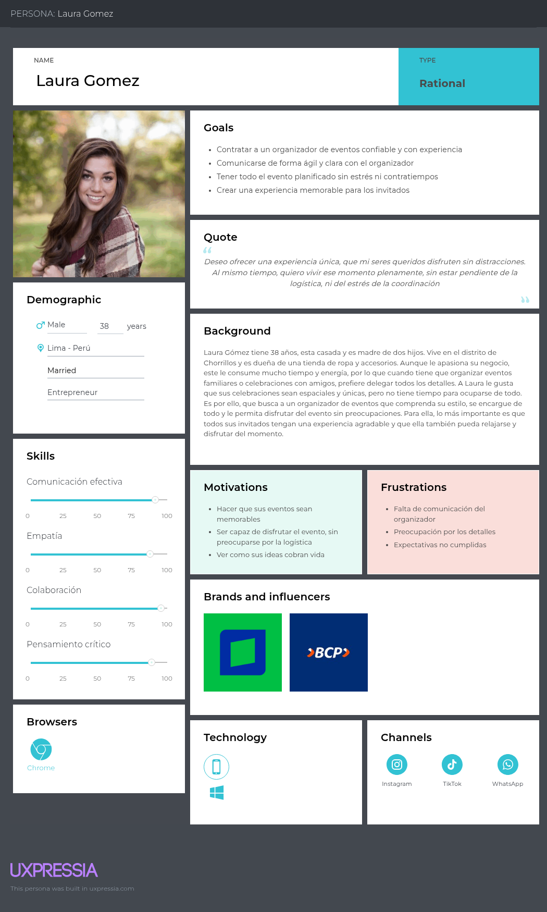

# Capítulo II: Requirements Elicitation & Analysis

## 2.1. Competidores

### 2.1.1. Análisis competitivo

<table border="1px">
        <thead>
            <th colspan="11">Competitive Analysis Landscepe</th>
        </thead>
        <tbody>
            <tr>
                <td rowspan="2" colspan="2">¿Por qué llevar a
                    cabo este análisis?</td>
                <td colspan="9">Escriba en el recuadro la pregunta que busca responder o el objetivo de
                    este análisis.</td>
            </tr>
            <tr>
                <td colspan="9">El objetivo de este análisis es comprender el funcionamiento y las características que presentan los productos de nuestros competidores, para posteriormente planificar estrategias y tácticas para aprovechar las fortalezas de nuestro producto y las debilidades de nuestros competidores.   </td> 
            </tr>
            <tr>
                <tr>
                    <td colspan="3">(En la cabecera colocar por cada competidor nombre y logo)</td>
                    <td colspan="2">Eventify</td>
                    <td colspan="2"> Bizzabo</td>
                    <td colspan="2"> PartySlate</td>
                    <td colspan="2"> Eventective</td>
                </tr>
            </tr>
            <tr>
                <td rowspan="2" colspan="1">Perfil</td>
                <td colspan="2">Overview</td>
                <td colspan="2">Plataforma que brinda herramientas de gestion para organizadores y los conecta con anfitriones que desean contratar sus servicios</td>
                <td colspan="2">Plataforma para la gestión de eventos corporativos, especializada en conferencias y experiencias presenciales, virtuales e híbridas </td>
                <td colspan="2">Plataforma donde organizadores de eventos pueden publicar sus servicios mediante portafolios visuales para atraer la atención de los anfitriones que buscan sus servicios.</td>
                <td colspan="2">Plataforma para buscar y contratar proveedores de servicios para eventos (locales, catering, etc.)</td>
            </tr>
            <tr>
                <td colspan="2"> Ventaja competitiva    ¿Qué valor ofrece a los clientes?</td>
                <td colspan="2">Los organizadores tienen herramientas que facilitan la gestion de eventos. Mientras que los anfitriones pueden encontrar, cotizar y analizar distintas propuestas desde un mismo lugar.</td>
                <td colspan="2">Permite crear y gestionar eventos(presencial, virtual o hibrido). Además presenta sección de networking para cada evento, permitiendo a los participantes interactuar entre ellos. </td>
                <td colspan="2">Ofrece a los organizadores presentar sus servicios mediante experiencias visuales basadas en portafolios de fotos y videos de eventos anteriores.</td>
                <td colspan="2">Ofrece facilidad para encontrar servicios para eventos (locales, catering, etc.), gracias a su amplia variedad de proveedores</td>
            </tr>
            <tr>
                <td rowspan="2" colspan="1">Perfil de Marketing</td>
                <td colspan="2">Mercado Objetivo</td>
                <td colspan="2">Organizadores de eventos y anfitriones ubicados en Lima, Perú</td>
                <td colspan="2">Empresas medianas y grandes que organizan conferencias, cumbres o lanzamientos de productos</td>
                <td colspan="2">Organizadores de eventos, proveedores (catering, musica, fotografos, etc.) y anfitriones, mayormente de EE.UU.</td>
                <td colspan="2">Proveedores de servicios para eventos (locales, catering, etc) y anfitriones que desean contratar sus servicios en EE.UU. y Canada</td>
            </tr>
            <tr>
                <td colspan="2">Estrategia de Marketing</td>
                <td colspan="2">Posicionamiento del Landing page del producto.   Campañas en Google Ads.   Publicidad en redes sociales.  Colaboración con organizadores de eventos</td>
                <td colspan="2">Posicionamiento del Landing page del producto.   Publicidad en redes sociales.   Organización de eventos propios para mostrar las caracteristicas de su plataforma</td>
                <td colspan="2">Publicidad en redes sociales    Posicionamiento de su plataforma</td>
                <td colspan="2">Publicidad en redes sociales    Posicionamiento de su plataforma</td>
            </tr>
            <tr>
                <td rowspan="3" colspan="1">Perfil de Producto</td>
                <td colspan="2">Producto & Servicio</td>
                <td colspan="2">Es una aplicación web que conecta a organizadores de eventos con anfitriones que necesitan contratar sus servicios. Además, ofrece herramientas para los organizadores, como calendarios de eventos, notas internas, comunicación directa con los anfitriones, entre otros.  </td>
                <td colspan="2">Es una aplicación web y movil que ofrece herramientas para gestion de eventos como registro de asistentes, gestión de entradas, networking y analiticas en tiempo real </td>
                <td colspan="2">Es una aplicación web que ofrece servicios de organizadores de eventos mediante portafolios visuales </td>
                <td colspan="2">Es una aplicación web que permite realizar busquedas de servicios de proveedores para eventos, como locales, catering, musica, etc.</td>
            </tr>
            <tr>
                <td colspan="2">Precio & Costos  </td>
                <td colspan="2">El registro a la aplicación sera de forma gratuita, sin embargo, para acceder a las herramientas de gestión, los organizadores deberan pagar una suscripción mensual.</td>
                <td colspan="2">La aplicación ofrece una tarifa de $17,999 por año</td>
                <td colspan="2">Publicación gratuida ilimitada y planes desde $195 a $695 mensuales para mayor visibilidad</td>
                <td colspan="2">Pago por leads o suscripción mensual de $100 a $170</td>
            </tr>
            <tr>
                <td colspan="2">Canales de distribucion (web y/o Movil)</td>
                <td colspan="2">Aplicación web</td>
                <td colspan="2">Aplicación web y Móvil</td>
                <td colspan="2">Aplicación web</td>
                <td colspan="2">Aplicación web</td>
            </tr>
            <tr>
                <td rowspan="5">Analisis SWOT</td>
                <td colspan="10">Realice esto para su startup y sus competidores. Sus fortalezas deberían apoyar sus
                    oportunidades y contribuir a lo que ustedes definen como su posible ventaja
                    competitiva</td>
            </tr>
            <tr>
                <td colspan="2">Fortalezas</td>
                <td colspan="2">Ofrecemos herramientas de gestión, como calendarios para organizar eventos, comunicación de organizadores y anfitriones</td>
                <td colspan="2"> Solución potente y robusta para eventos corporativos grandes. Además, se puede integrar con herramientas empresariales</td>
                <td colspan="2"> Permite a los organizadores y proveedores a crear portafolios visuales de sus servicios para captar la atención de los anfitriones</td>
                <td colspan="2"> Presenta una amplia variedad de proveedores registrados y es accesible para proveedores pequeños que inician en el rubro.</td>
            </tr>
            <tr>
                <td colspan="2">Debilidades</td>
                <td colspan="2">Nuestra aplicación es nueva en el mercado nacional, lo que podria complicar atraer nuevos usuarios</td>
                <td colspan="2">Es compleja y costosa para organizadores de eventos no masivos</td>
                <td colspan="2">Ofrece pocas opciones para el mercado nacional, ya que esta centrado mayormente para EE.UU. Además no ofrece herramientas de gestión</td>
                <td colspan="2">Presenta una interfaz muy simple y poco atractiva. Además, los servicios que ofrece solo estan disponibles en EE.UU. y Canada</td>
            </tr>
            <tr>
                <td colspan="2">Oportunidades</td>
                <td colspan="2">Es una solución escalable para nivel nacional e inclusive para todo latinoamerica.</td>
                <td colspan="2">Tiene la posibilidad de liderar el sector de eventos híbridos y virtuales, integrando tecnologías como IA para automatizar procesos de gestión.</td>
                <td colspan="2">Puede expandirse a nuevos países y fortalecer su red de organizadores mediante alianzas estratégicas</td>
                <td colspan="2">Puede mejorar su interfaz para dale mejor visibilidad a sus proveedores, además de integrar herramientas de gestión</td>
            </tr>
            <tr>
                <td colspan="2">Amenazas</td>
                <td colspan="2">Al ser una aplicación nueva, el exito depende tener una amplia cantidad de organizadores y anfitriones simultaneamente, ya que si hay poca oferta o demanda en la aplicación, los usuarios no tendrán motivos para permanecer activos.</td>
                <td colspan="2">La mayor parte de sus clientes son grandes empresas que requieren soluciones personalizadas. Si no cumplen con las expectativas, podrían perder contratos importantes </td>
                <td colspan="2">Competencia con redes sociales visuales, como Instragram</td>
                <td colspan="2">Puede quedar obsoleta frente a nuevas soluciones más modernas </td>
            </tr>
        </tbody>
    </table>

### 2.1.2. Estrategias y tácticas frente a competidores

**Estrategia de diferenciación:**
    
   - La estrategia de diferenciación se basa en ofrecer una solución de software única que se distinga de la competencia. En este caso, la propuesta es crear una aplicación web que conecte a organizadores de eventos con anfitriones, brindando herramientas de gestión para facilitar la planificación y ejecución de eventos. Esto permitirá a los organizadores optimizar su trabajo y a los anfitriones encontrar fácilmente el servicio que necesitan.
     

   * **Tácticas:**
   - Incluir funcionalidades como calendario, chat directo, cotizaciones, notas personalizadas y seguimiento por pasos.
   - Diseñar una interfaz intuitiva, clara y amigable desde el primer uso.

**Estrategia de liderazgo en costos:**
    
 - La estrategia de liderazgo en costos implica ofrecer una solución a un precio más bajo que la competencia. En este caso, se propone ofrecer una suscripción mensual asequible para los organizadores de eventos, lo que les permitirá acceder a herramientas de gestión sin incurrir en altos costos iniciales.
     

 * **Tácticas:**
  - Implementar un modelo freemium: registro gratuito y herramientas básicas sin costo.
  - Ofrecer una suscripción mensual accesible para funciones avanzadas, en contraste con los altos precios de aplicaciones como Bizzabo.
  - No cobrar comisiones por contratos gestionados dentro de la app.

**Estrategia de diferenciación enfocada:**
  
 - La propuesta se enfoca en atender a nichos específicos del mercado de eventos sociales (como cumpleaños, bodas y celebraciones familiares), evitando la complejidad de plataformas orientadas a eventos corporativos de gran escala.
     

 * **Tácticas:**
  - Simplificar las funcionalidades para que se adapten a las necesidades reales de los eventos sociales.
  - Ajustar la comunicación visual y verbal al tono cercano, emocional y personal que estos eventos suelen tener.

**Estrategias competitivas adicionales:**
    

 * **Tácticas:**
  - Permitir a los usuarios dejar reseñas y calificaciones de los organizadores.
  - Implementar notificaciones automáticas sobre el avance de cada evento (como recordatorios o pendientes).

**Estrategia de construcción de marca:**
    
 - Apostar por una identidad visual cálida, cercana y profesional, que conecte emocionalmente con el público objetivo y genere confianza.
     

 * **Tácticas:**
  - Desarrollar una identidad visual con colores amigables y un logo simple pero memorable.
  - Utilizar redes sociales como Instagram, TikTok y Facebook para mostrar casos reales de uso de la app (antes y después de eventos organizados con Eventify).
  - Fomentar una comunidad activa alrededor de la marca, compartiendo consejos y experiencias sobre organización de eventos.

## 2.2. Entrevistas

### 2.2.1. Diseño de entrevistas

Para el desarrollo de las entrevistas de los segmentos objetivos definidos, se redactaron las siguientes preguntas:
  

**Organizadores de eventos no masivos:**

**Preguntas Demográficas:**

* ¿Cuál es su nombre?
* ¿Qué edad tiene?
* ¿Como se definiría usando solo 3 adjetivos?
* ¿Cuál es su estado civil?
* ¿A qué se dedica? (freelance o como organización)
* ¿En qué distrito/provincia reside?
* ¿Hace cuánto tiempo lleva trabajando como organizador de eventos?
* ¿Porque decidió trabajar en el rubro de organizador de eventos?

**Preguntas de Hábitos Digitales:**

* Porque medio se comunica con sus clientes con mayor frecuencia (Whatsapp, Instagram, Facebook, correo Hotmail/Gmail)?
* ¿Con que dispositivo interactúa con mayor frecuencia (Pc, laptop, iPad)?
* ¿Cuál es el navegador web que con mayor frecuencia usa? (Chrome, Safari, Brave, Opera).

**Preguntas Principales:**

* ¿Qué tipo de eventos organiza con mayor frecuencia?
* ¿Cuántos eventos gestiona por mes (promedio)?
* ¿Qué diferencia nota de organizar un evento sencillo de uno complejo?
* ¿Cuál es el rango salarial para organizar un evento (quinceañero, boda, bautizo, etc.)?
* ¿Podría contarnos paso a paso, como es su proceso para organizar un evento, desde que un cliente lo contacta hasta el día del evento?
* ¿Como gestiona su planificación de eventos? ¿Utiliza alguna aplicación de calendario, agenda o recordatorio? ¿Alguna es de paga? ¿Si es así cuales y cuánto?

* ¿Qué desafíos encuentra al comunicarse con sus clientes?
* ¿Como ha logrado conseguir la mayoría de sus clientes, promocionándose en alguna red social, sitio web o por contactos? ¿Si es así cual y cómo?
* ¿Qué aspecto del trabajo considera que los clientes menos comprenden? ¿Hay términos técnicos en la organización de eventos?
* ¿Como gestiona el pago de sus eventos (cuotas, adelantos, al finalizar)?
* ¿Cuáles son los medios de pagos que utiliza con mayor frecuencia?
* ¿Cuáles son los factores (cantidad de invitados, temática, servicios, etc.) que considera para las cotizaciones de sus eventos con los clientes?
* ¿Qué le gustaría automatizar o simplificar de su trabajo?

**Preguntas Complementarias:**

* ¿Qué es lo que más valoran sus clientes en relación a sus servicios según su experiencia?
* ¿Qué es lo que más le frustra de trabajar como organizador de eventos en el ámbito de planificación? (Contratar servicios de terceros).
* ¿Ha tenido alguna experiencia mala con alguno cliente? ¿Como las resolvió?

  

**Anfitriones de Eventos**

**Preguntas Demográficas**

* ¿Cuál es su nombre?
* ¿Qué edad tiene?
* ¿Como se definiría usando solo 3 adjetivos?
* ¿Cuál es su estado civil?
* ¿A qué se dedicas?
* ¿En qué distrito/provincia reside?

**Preguntas de Hábitos Digitales**

* ¿Por medio de que navegador web contacto con el organizador?
* ¿Cuál es el dispositivo que utiliza con mayor frecuencia (laptop, Tablet, celular, computadora)?

**Preguntas Principales**

* ¿Alguna vez has contratado a algún organizador de eventos?
* ¿Cuál fue el último evento que contrato?
* ¿Con cuánto tiempo de anticipación comenzó a planearlo?
* ¿Como encontró al organizador de eventos? (Redes sociales, contactos, página web).
* ¿Qué factores considero para contratar a un organizador de eventos?
* ¿Solicito cotizaciones a diversos organizadores antes de decidir?
* ¿Hubo algo que le costó entender o comparar entre los diferentes servicios? ¿Si es así cuáles?
* ¿Cómo considera que fue la comunicación con el organizador y con qué frecuencia?
* ¿Por qué medios de comunicación fue la interacción con su organizador de eventos? (correo, WhatsApp).
* ¿Hubo algo que le hubiera gustado que le expliquen mejor?
* ¿Qué aspecto del evento le hubiera gustado mejorar? (DJ era malo, sillas en mal estado).
* ¿Como fue el proceso de cotización y pagos? ¿Porque medios fue realizado el pago?
* ¿Hubo algún gasto inesperado durante la planificación del evento? (Meseros extras).

**Preguntas Complementarias**

* ¿Recomendaría a otras personas contratar al mismo organizador de eventos?
* ¿Qué fue lo más satisfactorio de todo el proceso?
* Que fue lo mas frustrante/estresante de todo el proceso de planificación junto con su organizador?
* ¿Le pareció correcto el costo del evento?
* ¿Cuánto influye el costo en su decisión de contratación? (Prefiere pagar mas por calidad o busca opciones más económicas).
* ¿Sintió que entendieron bien su visión del evento con lo que organizaron?
* ¿Pudo hacer seguimiento al estado de pagos fácilmente?

### 2.2.2. Registro de entrevistas

A continuación, se presentará un resumen de cada entrevista realizada a los segmentos objetivo. Además, cada entrevista contará una captura de pantalla como evidencia y el intervalo de tiempo de duración que tienen en el video realizado, para que sea más sencillo ubicarlos.

  

**Segmento Objetivo: Anfitriones de Evento**
  

**Entrevista 1: John Rafael Cutiri Chinchay**

**Datos del entrevistado**
* **Nombre:** John Rafael Cutiri Chinchay
* **Edad:** 52 años
* **Estado civil:** Casado
* **Ocupación:** Comerciante
* **Distrito de Residencia:** Chorrillos

* **Duración de la entrevista:**
* **Video de las entrevistas:** [Needfinding - Interviews]()

**Resumen de la entrevista:**

El entrevistado se llama John Rafael Cutiri Chinchay, es una persona sobria, directa y de pocas palabras. Actualmente se encuentra casado, reside en Chorrillos y trabaja como comerciante. El navegador que utiliza con frecuencia es Google Chrome y su dispositivo preferido es el celular.

Durante la entrevista, el señor John relató su experiencia al contratar a un organizador de eventos para la fiesta de quince años de su hija. La planificación del evento duró aproximadamente 10 meses. El entrevistado contrató a este organizador tras solicitar varias cotizaciones con diferentes proveedores, decidiendo contratar al organizador recomendado por un familiar, ya que le generaba mayor confianza y las propuestas que recibió eran muy similares. Además, se convenció al ver videos de eventos anteriores publicados por este organizador en redes sociales.

Durante la planificación, la comunicación con el organizador se limitó a la firma del contrato, pero se intensificó a medida que se acercaba la fecha del evento, utilizando WhatsApp como canal principal. Tambien, comento que lo mas estresante fue este periodo cercano al evento, ya que sentia presión por la posibilidad de que algo pudiera faltar.

Respecto al desarrollo del evento, un aspecto que le hubiera gustado que se explicara con mayor claridad fue el tema del volumen de la música. Esto debido a que el local se encontraba en una zona de condominios y no se le permitió aumentar el volumen para evitar molestias a los vecinos. También manifestó cierta insatisfacción con la atención a los invitados, ya que notó que algunas mesas eran atendidas mientras otras no, lo cual evidenciaba una posible falta de personal.

En cuanto al pago, se estableció un adelanto del 30% y el resto a cancelar el día del evento. No obstante, el entrevistado optó por realizar pagos periódicos para facilitar la gestión económica. Todos los pagos se efectuaron mediante transferencia bancaria y no se presentaron gastos imprevistos. Aunque no recibió boletas ni facturas, conservó las capturas de pantalla como comprobantes de pago.

A pesar de los inconvenientes, el entrevistado se mostró satisfecho con el resultado final. Consideró que el evento cumplió sus expectativas y que el organizador logró plasmar su visión. Asimismo, afirmó que no habría pagado más por un servicio de mayor calidad, ya que lo recibido le pareció adecuado. Finalmente, mencionó que recomendaría al organizador por haber cumplido con lo prometido.

**Entrevista 2: [nombre]**

**Entrevista 3: [nombre]**

**Segmento Objetivo 2: Organizadores de Evento**
  

**Entrevista 1: Teodoro Paico Sernaqué**

**Datos del entrevistado:**
* **Nombre:** Teodoro Paico Sernaqué
* **Edad:** 54 años
* **Estado civil:** Conviviente
* **Ocupación:** Organizador de eventos.
* **Distrito de Residencia:** La Unión - Piura

* **Duración de la entrevista:** 24:19
* **Minuto de de la entrevista:** [ - ]

**Resumen de la entrevista:**

El entrevistado es un organizador de eventos con una empresa formalmente constituida y con razón social, respaldado por 12 años de experiencia en el rubro. Se describe como una persona responsable, entusiasta y apasionada por su trabajo. Su navegador web de preferencia es Google Chrome.

Durante la entrevista, compartió cómo ha sido su desarrollo profesional en el ámbito de la organización de eventos. Todo comenzó en el año 2012, cuando ofrecía servicios de alquiler de equipos de sonido. Al notar que el negocio era rentable y contribuía significativamente a su economía familiar, decidió expandirse y dedicarse de lleno al rubro de eventos.

Actualmente, mantiene comunicación con sus clientes principalmente a través de redes sociales como WhatsApp y Messenger, así como por llamadas telefónicas. Señaló que la publicidad por radio ha sido de gran ayuda para generar interacción con nuevos clientes.

Dentro de los eventos que organiza con mayor frecuencia destacan las bodas y los bautizos, aunque también presta servicios para fiestas infantiles, quinceañeros, baby showers, serenatas públicas y aniversarios. Ofrece distintos tipos de paquetes, los cuales varían según los servicios incluidos y los recursos requeridos. Desde el momento en que un cliente lo contacta, comienza a organizar su agenda de acuerdo a los requerimientos solicitados. A lo largo del proceso, mantiene una comunicación constante con el cliente para asegurar que todos los detalles se cumplan hasta el día del evento.

En cuanto a la gestión de pagos, indicó que trabaja bajo contrato: solicita un abono del 50% por adelantado y el saldo restante al finalizar el evento. Los medios de pago más utilizados son transferencias bancarias y efectivo.

Un aspecto que considera importante mejorar es la automatización del control y gestión de materiales e insumos. A pesar de los desafíos, se siente orgulloso de poder cumplir con las expectativas de sus clientes y brindarles una experiencia satisfactoria. Sin embargo, también ha enfrentado dificultades, como clientes que no cumplen con los pagos a tiempo o que solicitan más servicios de los previamente acordados. Ante estas situaciones, procura mantener una actitud positiva y aprender de cada experiencia para seguir mejorando en su labor.

**Entrevista 2: [nombre]**

**Entrevista 3: [nombre]**

### 2.2.3. Análisis de entrevistas

## 2.3. Needfinding

### 2.3.1. User Personas

En esta sección se presentarán los User Personas de cada segmento objetivo. Estos artefactos fueron diseñados a partir de la información obtenida en las entrevistas.
 

**Segmento Objetivo: Organizadores de eventos sociales no masivos**

  

**Segmento Objetivo: Anfitriones de eventos**

### 2.3.2. User Task Matrix

### 2.3.3. User Journey Mapping

### 2.3.4. Empathy Mapping

### 2.3.5. As-is Scenario Mapping

## 2.4. Ubiquitous Language