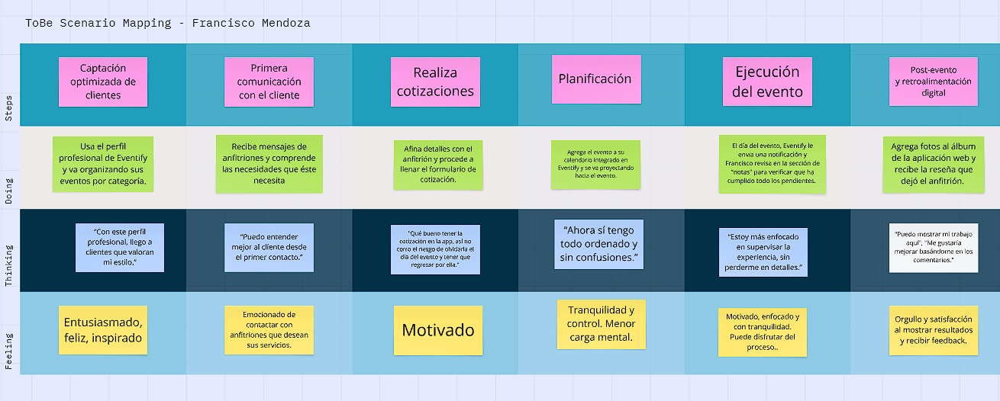
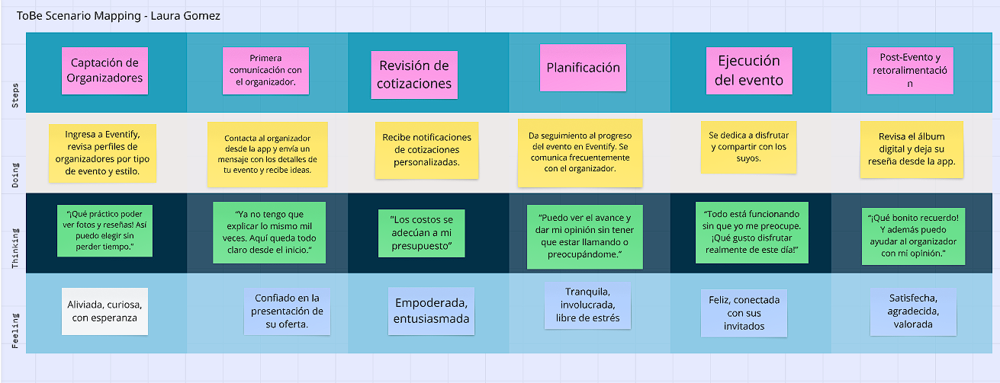

# Chapter III: Requirements Specification

## 3.1. To-Be Scenario Mapping

**Segmento Organizadores**

Este To-Be Scenario Mapping fue creado tras realizar una lluvia de ideas individual por parte del equipo, revisión en conjunto y alineamiento de las fases a partir del análisis del As-Is.

**Segmento Anfitriones**

A través de este escenario ToBe, se busca identificar las expectativas de los anfitriones al utilizar la aplicación. Se realizó una lluvia de ideas individual por parte del equipo, seguido de una revisión en conjunto para alinear las fases a partir del análisis del As-Is.

## 3.2. User Stories

En esta sección del informe se presentarán las épicas (EP), user stories (US) y technical stories (TS) definidas para el desarrollo tanto de la aplicación como del landing page. Las user stories abordarán las funcionalidades orientadas al usuario final, mientras que las technical stories estarán enfocadas en los requerimientos técnicos del backend.

| Epic/Story ID | Título                                        | Descripción                                                                                                                                                                                                                          | Criterios de Aceptación                                                                                                                                                                                                                                                                                                                                                                                                                                                                                                                                                                                                                                                                                                                                                                                                                                                                                                                                                                                                                                                                                                                                                                                                                                                                                                                                                                                     | Relacionado con (Epic ID) |
|---------------|-----------------------------------------------|--------------------------------------------------------------------------------------------------------------------------------------------------------------------------------------------------------------------------------------|-------------------------------------------------------------------------------------------------------------------------------------------------------------------------------------------------------------------------------------------------------------------------------------------------------------------------------------------------------------------------------------------------------------------------------------------------------------------------------------------------------------------------------------------------------------------------------------------------------------------------------------------------------------------------------------------------------------------------------------------------------------------------------------------------------------------------------------------------------------------------------------------------------------------------------------------------------------------------------------------------------------------------------------------------------------------------------------------------------------------------------------------------------------------------------------------------------------------------------------------------------------------------------------------------------------------------------------------------------------------------------------------------------------|---------------------------|
| EP01          | Diseño y Desarrollo de Landing page           | **Como** visitante   **Quiero** acceder a una landing page clara y atractiva   **Para** entender de que trata la aplicación, si es confiable y me permita acceder a la aplicación si cumple con mis necesidades.               |                                                                                                                                                                                                                                                                                                                                                                                                                                                                                                                                                                                                                                                                                                                                                                                                                                                                                                                                                                                                                                                                                                                                                                                                                                                                                                                                                                                                             |                           |
| US001         | Navegación sencilla                           | **Como** visitante   **Quiero** que la landing page me permita navegar fácilmente entre secciones,   **Para** acceder directamente a la sección que me interesa, sin tener que desplazarme por todo el contenido.              | **Escenario 01: Navegar a la sección Beneficios**   **Dado** que un visitante accede al landing page,   **Cuando** quiera conocer los beneficios que ofrece la aplicación.   **Entonces** dará click en el botón “Beneficios” de la barra de navegación.    **Escenario 02: Navegar a la sección Funcionalidades**   **Dado** que un visitante accede al landing page,   **Cuando** quiera conocer las funcionalidades que tiene la aplicación   **Entonces** dare click al botón Funcionalidades de la barra de navegación    **Escenario 03: Navegar a la sección Quienes Somos**   **Dado** que un visitante accede al landing page   **Cuando** quiera conocer quienes desarrollaron la aplicación  **Entonces,** dará click al botón "Quienes somos" de la barra de navegación    **Escenario 04: Navegar a la sección About the product**   **Dado** que un visitante accede al landing page   **Cuando** quiera ver como se utiliza la aplicación   **Entonces** dará click al botón "About the Product" de la barra de navegación    **Escenario 05: Volver al Inicio**   **Dado** que un visitante accede al landing page   **Cuando** se encuentre en las secciones inferiores   **Y** quiera volver al inicio   **Entonces** dará click al botón Inicio o el logo de la aplicación en la barra de navegación.      | EP01                      |
| US002         | Propuesta de valor clara                      | **Como** visitante   **Quiero** entender rápidamente que ofrece la aplicación   **Para** saber si es relevante para mi (organizador o anfitrión)                                                                               | **Escenario 01: Propuesta de valor al inicio del landing page**   **Dado** que un visitante intenta acceder al landing page,   **Cuando** se carga la sección principal   **Entonces** visualizará la propuesta de valor de la aplicación.    **Escenario 02: Lenguaje claro y directo**   **Dado** que un visitante accede al landing page   **Cuando** lea el contenido de las distintas secciones   **Entonces** debe percibir un leguaje claro, sencillo y empático.                                                                                                                                                                                                                                                                                                                                                                                                                                                                                                                                                                                                                                                                                                                                                                                                                                                                                                            | EP01                      |
| US003         | Información segmentada                        | **Como** visitante   **Quiero** ver información relacionada con mi rol (organizador o anfitrión)   **Para** identificar como puede ayudarme la aplicación                                                                      | **Escenario 01: Beneficios segmentados por tipo de usuario**   **Dado** que un visitante accede al landing page   **Cuando** se encuentre en la sección "Beneficios"   **Entonces** visualizará un listado de beneficios que brinda la aplicación para cada tipo de usuario    **Escenario 02: Funcionalidades segmentadas por tipo de usuario**   **Dado** que un visitante accede al landing page   **Cuando** se encuentre en la sección "Funcionalidades"   **Entonces** visualizará una lista de funcionalidades que presenta la aplicación para cada tipo de usuario.                                                                                                                                                                                                                                                                                                                                                                                                                                                                                                                                                                                                                                                                                                                                                                                                         | EP01                      |
| US004         | Funcionalidades de la aplicación              | **Como** visitante   **Quiero** que el landing page me muestre una lista de las funcionalidades que ofrece la aplicación   **Para** saber si cubre mis necesidades.                                                            | **Escenario 01: Funcionalidades destacadas segun tipo de usuario**   **Dado** que un visitante esta navegando por el landing page   **Cuando** se encuentre en la sección "Funcionalidades"   **Entonces** se mostrarás las funcionalidades más relevantes para cada tipo de usuario    **Escenario 02: Organización visual de las funcionalidades**   **Dado** que un visitante se encuentra en la sección "Funcionalidades"   **Cuando** visualice la lista de funcionalidades   **Entonces** deberán estar organizadas de manera lógica, con títulos claros e íconos representativos.                                                                                                                                                                                                                                                                                                                                                                                                                                                                                                                                                                                                                                                                                                                                                                                            | EP01                      |
| US005         | Llamada a la acción                           | **Como** visitante   **Quiero** que el landing page me de la opción de acceder directamente a la aplicación   **Para** comenzar a utilizarla                                                                                   | **Escenario 01: Registro desde la sección principal**   **Dado** que un visitante accede al landing page   **Cuando** cargue la sección principal   **Entonces** se mostrará un botón grande con el mensaje "Registrate"    **Escenario 02: Persuasión en secciones complementarias**   **Dado** que un visitante accede al landing page   **Cuando** se encuentre en secciones complementarias ("Beneficios", "Funcionalidades", etc.)   **Entonces** se mostrarán botones de llamada a la acción, con mensajes persuasivos, para elentar al visitante a registrarse.                                                                                                                                                                                                                                                                                                                                                                                                                                                                                                                                                                                                                                                                                                                                                                                                              | EP01                      |
| US006         | Visualización de tutorial de la aplicación    | **Como** visitante   **Quiero** que el landing page me muestre visualmente como funciona la aplicación   **Para** tener una idea concreta de como debo usarla.                                                                 | **Escenario 01: Demostración de uso**   **Dado** que un visitante quiere saber como usar la aplicación   **Cuando** se encuentre en la sección "About the product"   **Entonces** prodrá reproducir un video demostrativo de la aplicación.    **Escenario 02: Interacción con controles del video demostrativo**   **Dado** que un visitante se encuentra viendo el video demostrativo   **Cuando** quiera revisar con más detalle el video   **Entonces** podrá retroceder, avanzar o pausar el video con los controles.                                                                                                                                                                                                                                                                                                                                                                                                                                                                                                                                                                                                                                                                                                                                                                                                                                                          | EP01                      |
| US007         | Confianza y seguridad                         | **Como** visitante,   **Quiero** que el landing page me muestre quienes fueron los encargados en desarrollar la aplicación   **Para** verificar que es segura y confiable.                                                     | **Escenario 01: Visualización del equipo de desarrollo**  **Dado** que un visitante este interesado en conocer al equipo detrás de la aplicación   **Cuando** se encuentre en la sección "Quienes Somos"   **Entonces** se mostrará la foto, nombre y rol de cada integrante del equipo.    **Escenario 02: Acceso a perfiles profesionales**   **Dado** que un visitante se encuentra en la sección "Quienes Somos"   **Cuando** presione sobre alguna de las fotos de los integrantes   **Entonces** sera redirigido a su perfil de LinkedIn                                                                                                                                                                                                                                                                                                                                                                                                                                                                                                                                                                                                                                                                                                                                                                                                                                      | EP01                      |
| US008         | Velocidad de carga                            | **Como** visitante,   **Quiero** que el landing page cargue rápidamente   **Para** no perder el interés.                                                                                                                       | **Escenario 01: Carga rápida del sitio web**   **Dado** que soy un visitante con conexión a internet estándar   **Cuando** intente acceder al landing page   Entonces deberá cargar en un máximo de 3 segundos    **Escenario 02: Optimización para usuarios con mala conexión**   **Dado** que un visitante tenga mala conexión a internet   **Cuando** acceda al landing page   **Entonces** se deberá cargar el contenido optimizadamente (lazy loading)                                                                                                                                                                                                                                                                                                                                                                                                                                                                                                                                                                                                                                                                                                                                                                                                                                                                                                                         | EP01                      |
| US009         | Diseño responsive                             | **Como** visitante,   **Quiero** que el landing page se vea y funcione correctamente desde cualquier dispositivo   **Para** tener una experiencia fluida y consistente en todo momento.                                        | **Escenario 01: Acceder desde una computadora o laptop**   **Dado** que un accede desde una computadora o laptop   **Cuando** cargue el landing page   **Entonces** el contenido deberá adaptarse a la pantalla del dispositivo sin errores de visualización    **Escenario 02: Acceder desde un celular o tablet**   **Dado** que un visitante accede desde un smartphone o tablet   **Cuando** cargue el landing page   **Entonces** el contenido debe ser visible sin necesidad de hacer zoom                                                                                                                                                                                                                                                                                                                                                                                                                                                                                                                                                                                                                                                                                                                                                                                                                                                                                    | EP01                      |
| EP02          | Comunicación Organizador-Anfitrión            | **Como** usuario (organizador o anfitrión),   **Quiero** tener un canal de comunicación claro y eficiente dentro de la plataforma    **Para** coordinar todos los detalles del evento sin depender de múltiples apps externas. |                                                                                                                                                                                                                                                                                                                                                                                                                                                                                                                                                                                                                                                                                                                                                                                                                                                                                                                                                                                                                                                                                                                                                                                                                                                                                                                                                                                                             |                           |
| US010         | Chat integrado en la plataforma               | **Como** usuario (organizador o anfitrión),   **Quiero** acceder a un chat dentro de la plataforma,    **Para** comunicarme directamente con la otra parte sin salir de la aplicación.                                         | **Escenario 01: Iniciar chat desde el perfil del organizador**   **Dado** que un anfitrión visualiza el perfil de un organizador,   **Cuando** haga clic en el botón “Mensaje”.    **Entonces** se abrirá una ventana de chat vinculada a ese organizador y al evento correspondiente.     **Escenario 02: Acceder al chat desde el panel**    **Dado** que un usuario (anfitrión u organizador) accede a su cuenta,   **Cuando**  ingrese a la sección de mensajes.    **Entonces** podrá ver los chats activos vinculados a sus eventos.                                                                                                                                                                                                                                                                                                                                                                                                                                                                                                                                                                                                                                                                                                                                                                                                                                    | EP02                      |
| US011         | Historial de mensajes                         | **Como** usuario (organizador o anfitrión),   **Quiero** poder revisar conversaciones anteriores,     **Para** no olvidar acuerdos o detalles importantes del evento.                                                          | **Escenario 01: Visualización del historial completo**    **Dado** que un anfitrión u organizador abre el chat de un evento,    **Cuando**  haya mensajes previos.    **Entonces** se mostrarán cronológicamente desde el más antiguo hasta el más reciente.      **Escenario 02: Carga automática del historial**    **Dado** que un anfitrión u organizador ingresa a un chat,    **Cuando**   la conversación ya tenga mensajes previos.    **Entonces** estos se cargarán automáticamente al abrir el chat.                                                                                                                                                                                                                                                                                                                                                                                                                                                                                                                                                                                                                                                                                                                                                                                                                                                               | EP02                      |
| US012         | Notificaciones de nuevos mensajes             | **Como** usuario (organizador o anfitrión),   **Quiero** recibir notificaciones cuando tengo un nuevo mensaje,      **Para** mantenerme al tanto de la conversación sin retrasos.                                              | **Escenario 01: Notificación visual en la plataforma**    **Dado** que un anfitrión u organizador está navegando dentro de la plataforma,     **Cuando**  reciba un nuevo mensaje.     **Entonces** verá un ícono de notificación en la sección de mensajes.       **Escenario 02: Alerta emergente**     **Dado** que un anfitrión u organizador tiene la sesión activa,     **Cuando**   le llegue un nuevo mensaje.     **Entonces**  podrá recibir una alerta visual (según configuración del navegador).                                                                                                                                                                                                                                                                                                                                                                                                                                                                                                                                                                                                                                                                                                                                                                                                                                                                 | EP02                      |
| US013         | Envío de archivos (PDF, imágenes, etc.)       | **Como** organizador o anfitrión,    **Quiero** poder enviar y recibir archivos dentro del chat,       **Para** compartir cotizaciones, formularios, referencias visuales o documentos importantes.                            | **Escenario 01: Envío de formulario por parte del organizador**     **Dado** que un organizador recibe un primer mensaje de un anfitrión iniciando contacto,   **Cuando**  abre el chat correspondiente al evento.      **Entonces** podrá adjuntar un formulario PDF con preguntas sobre el evento y enviarlo al anfitrión.        **Escenario 02: Recepción del formulario por parte del anfitrión**      **Dado** que un anfitrión ha iniciado conversación con un organizador,      **Cuando**  el organizador le envía el formulario como archivo adjunto.     **Entonces**  el anfitrión podrá visualizar y descargar el archivo desde el chat.     **Escenario 03:  Envío de proforma por parte del organizador**    **Dado** que un organizador ha recibido el formulario completado por el anfitrión,    **Cuando** quiera enviarle una cotización personalizada.   **Entonces,** podrá adjuntar un archivo PDF con la proforma y enviarlo a través del chat del evento.     **Escenario 04: Intercambio de archivos posteriores**    **Dado** que el anfitrión y el organizador ya han iniciado conversación,    **Cuando** cualquiera desee compartir un archivo adicional (como una imagen de decoración, plano, flyer, etc.).   **Entonces** podrá adjuntarlo y enviarlo desde la ventana del chat.                                | EP02                      |
| US014         | Estado del mensaje (enviado, recibido, leído) | **Como** organizador o anfitrión,    **Quiero** ver el estado de mis mensajes enviados,       **Para** saber si han sido leídos por la otra persona.                                                                           | **Escenario 01: Estado "enviado"**     **Dado** que un anfitrión u organizador envía un mensaje,      **Cuando**  el mensaje se procese correctamente.      **Entonces** aparecerá con un ícono de "enviado".        **Escenario 02: Estado "recibido" y "leído"**      **Dado** que un anfitrión u organizador envía un mensaje,      **Cuando**   la otra parte reciba o lea el mensaje.     **Entonces**  el ícono cambiará según corresponda para indicar su estado.                                                                                                                                                                                                                                                                                                                                                                                                                                                                                                                                                                                                                                                                                                                                                                                                                                                                                                      | EP02                      |
| US015         | Notificación por email si no estoy conectado  | **Como** organizador o anfitrión,    **Quiero** recibir notificaciones fuera de la app si tengo mensajes sin leer,        **Para** no perderme nada importante cuando no estoy conectado.                                      | **Escenario 01: Envío de correo electrónico automático**       **Dado** que un anfitrión u organizador no está conectado a la plataforma,       **Cuando**  reciba un nuevo mensaje.       **Entonces** se enviará una notificación por correo electrónico al usuario.         **Escenario 02: Visualización del contenido del mensaje (correo)**      **Dado** que un anfitrión u organizador reciba una notificacion de alerta por correo,      **Cuando**   visualice el contenido del mensaje.     **Entonces**  podra identificar que tiene mensajes sin responder o visualizar dentro de la aplicación.                                                                                                                                                                                                                                                                                                                                                                                                                                                                                                                                                                                                                                                                                                                                                                 | EP02                      | 

## 3.3. Impact Mapping

## 3.4. Product Backlog