# Capítulo V: Product Implementation, Validation & Deployment

## 5.1. Software Configuration Management

Con el fin de garantizar la consistencia, trazabilidad y calidad a lo largo del ciclo de vida de Eventify, el equipo ha definido un conjunto de decisiones y convenciones orientadas a la gestión de configuraciones. Esta sección describe los mecanismos adoptados para controlar el código fuente, configurar los entornos de desarrollo y definir el proceso de despliegue de la aplicación web.

Estas prácticas permiten asegurar que las versiones del software se mantengan estables, que el trabajo colaborativo sea eficiente y que las implementaciones sean controladas y reproducibles.

### 5.1.1. Software Development Environment Configuration

Para asegurar una colaboración eficiente y mantener la calidad en el desarrollo de Eventify, se ha definido un entorno de desarrollo común para todos los miembros del equipo. A continuación, se listan los productos de software utilizados en las distintas etapas del ciclo de vida del producto digital, indicando su propósito y su enlace de referencia o descarga correspondiente.

**Product UX/UI Design**

Para el diseño de la experiencia de usuario y la interfaz de la Landing page de Eventify, se utilizaron las siguientes herramientas:

- Figma: Se empleó para la creación de wireframes, mock-ups y prototipos de la aplicación web.[https://www.figma.com/es-es/](https://www.figma.com/es-es/)
- UXPressia: Utilizada para elaborar User Personas, Empathy Maps, Journey Maps e Impact Maps. [https://uxpressia.com/](https://uxpressia.com/)
- Miro: Se utilizó para la creación de los mapas de escenarios As-Is y To-Be. [https://miro.com/es/](https://miro.com/es/)

**Software Development**

Para el desarrollo del software del Landing Page, se adoptaron los siguientes productos:

- WebStorm (Instalación local): Utilizado como entorno de desarrollo para trabajar con HTML, CSS y JavaScript. [https://www.jetbrains.com/es-es/webstorm/](https://www.jetbrains.com/es-es/webstorm/)
- Git (Instalación local): Empleado para gestionar los cambios de código de manera local mediante commits y ramas. [https://git-scm.com/](https://git-scm.com/)
- GitHub: Plataforma de repositorio remoto para la gestión de versiones del código, implementando el flujo GitFlow para garantizar un desarrollo organizado. [https://github.com/](https://github.com/)

**Project Management and Collaboration**

En la gestión de proyectos y colaboración del equipo se utilizaron:

- Trello: Utilizado para la planificación y seguimiento de tareas, distribuidas en listas de "por hacer", "en progreso" y "hecho". 
- WhatsApp: Medio de comunicación instantánea para coordinar avances, resolver dudas rápidas y hacer recordatorios. [https://web.whatsapp.com/](https://web.whatsapp.com/)
- Discord: Utilizado como plataforma de comunicación por voz y chat, facilitando reuniones rápidas y discusiones técnicas en equipo. [https://discord.com/](https://discord.com/)
- Zoom: Herramienta utilizada para realizar reuniones virtuales más formales, presentaciones de avances y coordinación general del equipo. [https://www.zoom.com/es](https://www.zoom.com/es)

**Software Documentation**

Para la documentación del proyecto se emplearon las siguientes herramientas:

- Vertabelo: Herramienta utilizada para el diseño, creación y documentación colaborativa de bases de datos. [https://vertabelo.com/](https://vertabelo.com/) 
- Lucidchart: Utilizada para la creación de diagramas UML, wireflows y user flows que ayudan en la planificación y visualización del sistema. [https://www.lucidchart.com/pages](https://www.lucidchart.com/pages)
- Structurizr: Herramienta usada para modelar la arquitectura de software mediante diagramas C4. [https://structurizr.com/](https://structurizr.com/)


**Software Testing**

En cuanto a la validación del software:

- WebStorm Preview: Se utilizó la función de vista previa integrada en WebStorm para revisar manualmente archivos .md y otros componentes antes de ser integrados en el repositorio de GitHub. [https://www.jetbrains.com/es-es/webstorm/](https://www.jetbrains.com/es-es/webstorm/)

### 5.1.2. Source Code Management

La gestión del código fuente es una parte fundamental en el desarrollo colaborativo de software, ya que permite un control eficiente sobre las modificaciones realizadas en el proyecto a lo largo de su ciclo de vida. En este apartado, se describe el sistema de control de versiones implementado en el proyecto Eventify, utilizando GitHub como plataforma principal. Además, se detallan las convenciones de trabajo adoptadas por el equipo, como el modelo GitFlow, el versionado semántico (Semantic Versioning) y las convenciones de commit mediante Conventional Commits. Estas prácticas aseguran un desarrollo ordenado y una integración continua efectiva entre los miembros del equipo.

**URL de los Repositorios:**
- Organización: [https://github.com/AngelDevs-Web](https://github.com/AngelDevs-Web)
- Reporte: [https://github.com/AngelDevs-Web/eventify-project-report](https://github.com/AngelDevs-Web/eventify-project-report)
- Landing Page: [https://github.com/AngelDevs-Web/eventify-landing-page](https://github.com/AngelDevs-Web/eventify-landing-page)

**Estructura de Ramas:**

Para mantener un flujo organizado en el desarrollo y facilitar la colaboración, se ha implementado el modelo GitFlow, creando las siguientes ramas:

- Master Branch: Rama principal (main) que contiene las versiones estables del proyecto. Todas las demás ramas derivan de esta.
- Develop: Rama secundaria donde se integran todas las características nuevas antes de fusionarse a la rama main.
- Feature Branches (Chapter I,II,III,IV,V): Para esta primera entrega son ramas dedicadas a cada capítulo del informe, permitiendo que cada miembro trabaje de manera independiente sin afectar el desarrollo principal.
- Release Branche: Rama creada cuando el equipo decide que la rama develop está lista para ser convertida en una nueva versión estable.
- Cover: Rama destinada a los elementos de la portada del informe.
- Student-outcome: Rama dedicada a los resultados de cada uno de los integrantes en relacion con el proyecto.
- Bibliography: Rama cuya funcionalidad es realizar la bibliografia del informe del proyecto.
- Annexes: Rama destinada a enumarar los anexos de cada entrega del informe.

**Convenciones de commits:**

Para la escritura de commits en el proyecto Eventify, se sigue la convencion 'Conventional Commits', el cual cuenta con un formato estándar para facilitar la lectura y entendimiento del historial de cambios dentro del proyecto.
```
    <type>[optional scope]: <description>
    
    [optional body]
    
    [optional footer(s)]
```
- Type:
  - feat: Añadir una nueva característica.
  - fix: Correción de errores.
  - docs: Modificaciones en la documentación.
  - style: Cambios que no afectan la lógica del código.
  - refactor: Modificaciones que no añaden características y/o errores.
  - test: Adición/Modificación de pruebas.
 

- Scope: Brinda información extra acerca del área del codigo afectado.
```
   feat(auth): add register functionality.
```
**Ejemplos básicos de commits:**
```
   feat(login): add organizer authentication module.
```
```
   fix(payment): resolve payment security issue.
```
```
   docs(README): update index instructions.
```

### 5.1.3. Source Code Style Guide & Conventions

El establecimiento de una guía de estilo y convenciones de codificación es fundamental para garantizar que el código sea legible, mantenible y coherente a lo largo del ciclo de vida del proyecto. En esta sección, describimos las convenciones adoptadas por el equipo para la programación en los lenguajes utilizados en el proyecto Eventify, que incluyen HTML, CSS, JavaScript y C#. 

Estas convenciones cubren aspectos como el nombrado de variables, funciones, clases y archivos, así como las mejores prácticas para la escritura de código, siguiendo guías de estilo reconocidas y estándares de la industria. Al adherirnos a estas convenciones, buscamos asegurar la calidad del código y facilitar la colaboración entre los miembros del equipo, evitando inconsistencias y errores comunes.

**Nomenclatura General:**

Para garantizar una correcta coherencia en todo el código, se seguirán las siguientes pautas:

- Los nombres de variables, funciones y métodos deben utilizar **camelCase**.
- Los nombres de clases y componentes seguirán la convención **PascalCase**.
- Para los archivos y carpetas, se empleará la convención **kebab-case**.

Se optará por usar Inglés para todos los nombres con el fin de asegurar la comprensión entre los miembros del equipo y facilitar la colaboración internacional.

Ejemplos:

- Variables: ```organizerName```, ```hostName```
- Clases: ```ListEvents```, ```Organizer```
- Archivos: ```host-message.service.js```,```organizer.controller.js```

**Espacios y Sangría**

La sangría del código en EVENTIFY seguirá las siguientes directrices para asegurar claridad y orden:

- Se utilizarán 2 espacios para la sangría en archivos HTML, CSS y JavaScript.
- En archivos C#, se utilizarán 4 espacios para la sangría.

Esta directriz permite mantener consistencia en todos los lenguajes empleados para este proyecto, facilitando la colaboracion entre todos los miembros del grupo.

**Ejemplo de HTML con sangría:**
```html
<!DOCTYPE html>
<html>
  <head>
    <title>Eventify</title>
  </head>
  <body>
    <h1>Encuentra a tu organizador de eventos!</h1>
    <p>No esperes más...</p>
  </body>
</html>
```
**Convenciones por Lenguaje:**

- Framework:
  - Usaremos Vue como Framework para el desarrollo del Front-End.
- Tecnologías:
    - HTML5, CSS3 para aspectos estáticos y presentación.
    - JavaScript para añadir interactividad y lógica.
- Diseño:
   - Tanto para el Landing Page como para la aplicacion web usaremos Material Design, con el obejtivo de asegurar una correcta, moderna y optimizada experiencia de usuario. 
- Biblioteca de componentes de UI:
   - Se opta por usar PrimeVue como biblioteca principal para componentes de la interfaz de usuario, lo cual facilita la creacion de interfaces interactivas y atractivas.
- Estilo y Estructura:
   - HTML/CSS: Seguiremos la [Guía de Estilo HTML y CSS](https://google.github.io/styleguide/htmlcssguide.html)  brindada por Google, con la finalidad de mantener consistencia y legibilidad en los archivos.
   - JavaScript: Para el código JavaScript, se aplicará la [Guía de Estilo de JavaScript de Airbnb](https://github.com/airbnb/javascript), para asegurar un código limpio, legible y sobre todo bien estructurado.
- Arquitectura del proyecto:
   - Gracias a Vue, la arquitectura del proyecto sera por componentes, donde cada funcionalidad, seccion de la aplicacion se encapsula en un archivo independiente que gestiona su propio estado y comportamiento.

**Ejemplo de Convención para un Componente en Vue:**

```vue

<template>
  <div>
    <Button label="example" @click="generateExample"/>
  </div>
</template>

<script>
  export default {
    name: 'Example',
    data() {
      return {
        numberOfExamples: 9
      };
    },
    methods: {
      generateExample() {
        if (this.numberOfExamples > 0) {
          this.numberOfExamples--;
        }
      }
    }
  };
</script>

<style scoped>
  /* Aplicando Material Design a través de PrimeVue */
  button {
    background-color: #3cc7a8;
    color: white;
  }
</style>
```
**Gherkin:**
- Para redactar los tests automatizados, seguimos la convención de [Gherkin Syntax](https://cucumber.io/docs/gherkin/). Esto permite una descripción clara y precisa de los escenarios de prueba en los archivos .feature.
- Utilizamos Given-When-Then para describir el comportamiento esperado en cada escenario.

**Espaciado:**
- Consideramos siempre colocar un espaciado entre operadores y parámetros en las funciones.

Ejemplo:
```vue
<script>
export default {
  data() {
    return {
      example1: 23,
      example2: 5,
      example3: 1
    };
  },
  mounted() {
    this.availableExamples = this.example1 - this.example3 - this.example2;
  }
};
</script>
```
**Comillas:**
- En JavaScript dentro de Vue, usaremos comillas simples('') para las cadenas.

**Límite de Longitud de Línea:**
- No debe exceder las 80 columnas por línea. Si ese fuera el caso, deberemos de dividir la linea del código para una mejor claridad y limpieza.

### 5.1.4. Software Deployment Configuration
En esta sección se detalla la configuración necesaria para el despliegue de la solución eventify, incluyendo los pasos clave para lograr la publicación satisfactoria de la **landing page** utilizando github pages para visualizar cada commit de la **landing page**.

A continuación, se describen los pasos para realizar el despliegue de la **landing page** del proyecto **Eventify**:

##### 1. Actualización de ramas

Asegúrese de que todas las ramas del repositorio estén actualizadas. luego, ingresa a github y dirígete al repositorio del proyecto **Eventify**.

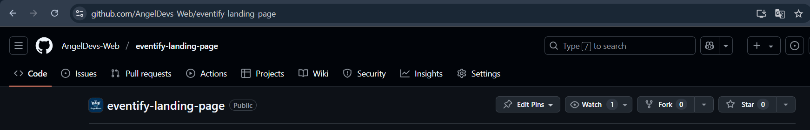

##### 2. Acceso a las configuraciones

Una vez dentro del repositorio, haz clic en la pestaña **settings** en la parte superior del repositorio.

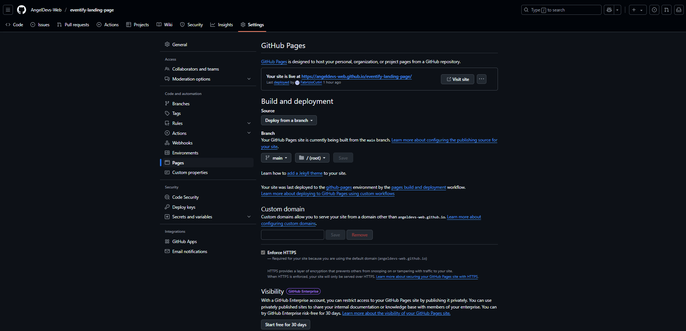

##### 3. Selección de github pages

Dentro de la sección **settings**, en el menú lateral, busca la opción llamada **pages**. esta opción permite configurar el despliegue de la página desde una rama específica del repositorio.

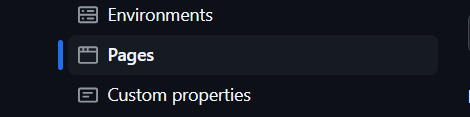

##### 4. Configuración de la rama principal

En la opción **pages**, selecciona la rama principal (generalmente llamada **main** o **master**). luego, haz clic en el botón **save** para iniciar el proceso de deploy de la página.
<br>
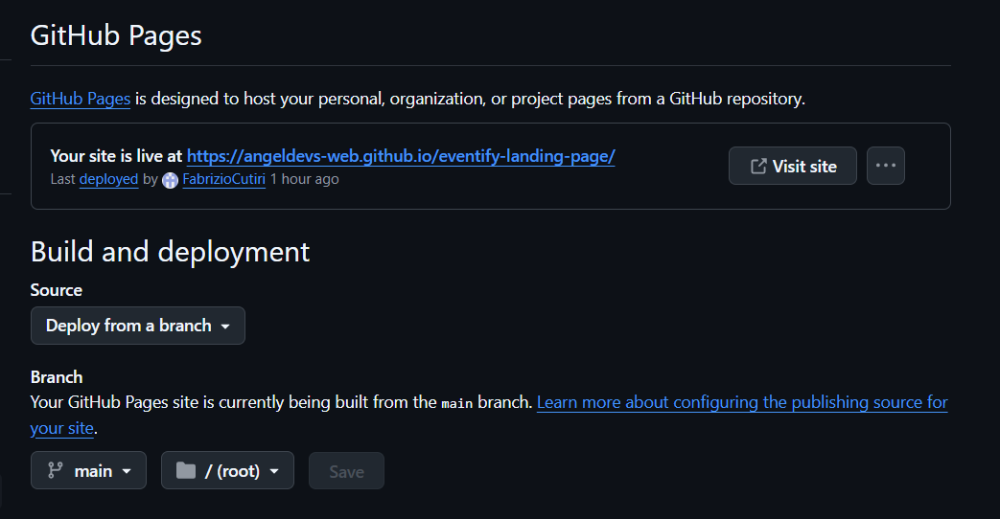
<br>
##### 5. Confirmación del deploy

Una vez que github complete el proceso de deploy, en la parte superior de la sección **pages** se mostrará un mensaje de confirmación junto con el enlace generado para acceder a la **landing page** del proyecto. <br>

##### 6. Acceso a la página

Finalmente, podrás acceder a la **landing page** desde el enlace que se generó al finalizar el deploy. aquí está un ejemplo de enlace:  
`https://angeldevs-web.github.io/eventify-landing-page/`

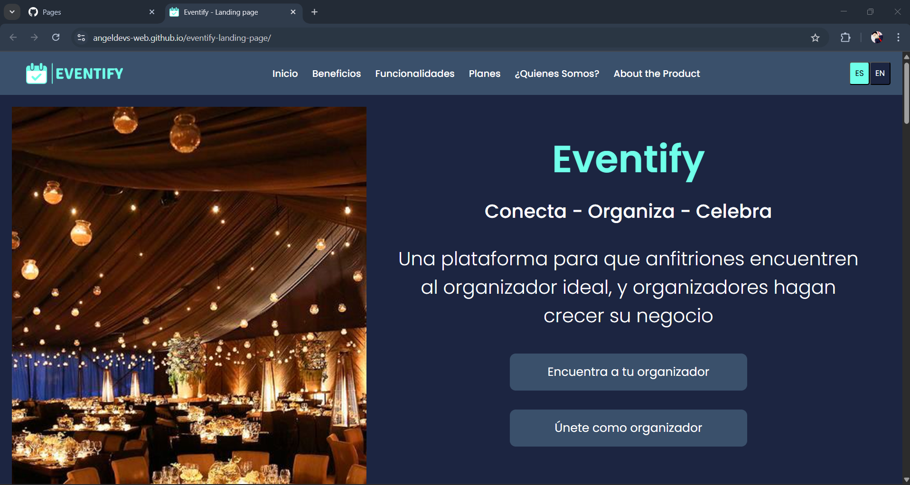


## 5.2. Landing Page, Services & Applications Implementation

### 5.2.1. Sprint 1

En el Sprint 1, nos enfocamos en diseñar y desarrollar la Landing Page de Eventify, con el objetivo de presentar de forma clara y atractiva los beneficios de la plataforma para organizadores y anfitriones de eventos. Durante este sprint, trabajamos en una estructura de navegación intuitiva y una disposición visual que permitiera resaltar las características principales del servicio. Nos organizamos como equipo para dividir las tareas y lograr un diseño completamente responsivo, asegurando que la página se visualice correctamente en distintos tamaños de pantalla.


#### 5.2.1.1. Sprint Planning 

|             Sprint #             |                                                                                                                                                                                                                                                                                                                                                                                                                                                 Sprint 1                                                                                                                                                                                                                                                                                                                                                                                                                                                 |
|:--------------------------------:|:--------------------------------------------------------------------------------------------------------------------------------------------------------------------------------------------------------------------------------------------------------------------------------------------------------------------------------------------------------------------------------------------------------------------------------------------------------------------------------------------------------------------------------------------------------------------------------------------------------------------------------------------------------------------------------------------------------------------------------------------------------------------------------------------------------------------------------------------------------------------------------------------------------:|
|  **Sprint Planning Background**  |                                                                                                                                                                                                                                                                                                                                                                                                                                                                                                                                                                                                                                                                                                                                                                                                                                                                                                          |
|               Date               |                                                                                                                                                                                                                                                                                                                                                                                                                                                 25/04/25                                                                                                                                                                                                                                                                                                                                                                                                                                                 |
|               Time               |                                                                                                                                                                                                                                                                                                                                                                                                                                               23:40 horas                                                                                                                                                                                                                                                                                                                                                                                                                                                |
|             Location             |                                                                                                                                                                                                                                                                                                                                                                                                                                      Reunión virtual - Zoom/Discord                                                                                                                                                                                                                                                                                                                                                                                                                                      |
|           Prepared By            |                                                                                                                                                                                                                                                                                                                                                                                                                                    Fabrizio Alexander Cutiri Agüero                                                                                                                                                                                                                                                                                                                                                                                                                                      |
|            Attendees             |                                                                                                                                                                                                                                                                                                                                                          - Aldave Aldave Jean Pierr <br> - Omar Christian Berrocal Ramirez  <br> - Deybbi Anderson Crisanto Calle  <br> - Fabrizio Alexander Cutiri Agüero  <br> - July Zelmira Paico Calderon                                                                                                                                                                                                                                                                                                                                                           |
|    Sprint n-1 Review Summary     |    Este es el primer sprint a realizar por el equipo                                                                                                                                                                                                                                                                                                                                                                                                                                                                                                                                                                                                                                                                                                                                                                                                                                                                                                   |
| Sprint n-1 Retrospective Summary |   Durante este srpint se acordó implementar reuniones frecuentes para hacer un seguimiento del avance y cumplir las metas establecidas. Además destacó el compromiso de los miembros del equipo por cumplir con los objetivos establecidos.                                                                                                                                                                                                                                                                                                                                                                                                                                                                                                                                                                                                                                                                                                                                                                                                                                                                                                      |
|  **Sprint Goal & User Stories**  |                                                                                                                                                                                                                                                                                                                                                                                                                                                                                                                                                                                                                                                                                                                                                                                                                                                                                                          |
|          Sprint 1 Goal           | Nuestro enfoque en este sprint estuvo en desarrollar la Landing Page de Eventify, ofreciendo a los nuevos usuarios una interfaz visualmente atractiva y fácil de navegar que les permitiera conocer a fondo nuestra propuesta. Nos centramos en construir secciones clave como Inicio, Beneficios, Funcionalidades, Planes, Quiénes Somos y About the Product, con el fin de comunicar de forma clara el valor que Eventify aporta a organizadores y anfitriones de eventos. <br/>Creemos que esto ayuda a los usuarios a comprender rápidamente cómo funciona la plataforma, generando una experiencia inicial positiva y confiable. <br/>Validaremos este trabajo cuando la Landing Page esté completamente operativa, con una navegación fluida, contenido informativo en cada sección y una experiencia responsiva que permita a los usuarios interactuar correctamente desde cualquier dispositivo. |
|        Sprint 1 Velocity         |                                                                                                                                                                                                                                                                                                                                                                                                                                     Velocidad de 18 - Primer Sprint                                                                                                                                                                                                                                                                                                                                                                                                                                      |
|       Sum of Story Points        |                                                                                                                                                                                                                                                                                                                                                                                                                                        Sprint 1 - 18 Story Points                                                                                                                                                                                                                                                                                                                                                                                                                                        |

|             Sprint #             |                                                                                                                                                                                                                                                                                                                                                                                                                                                                                                      Sprint 2                                                                                                                                                                                                                                                                                                                                                                                                                                                                                                       |
|:--------------------------------:|:-------------------------------------------------------------------------------------------------------------------------------------------------------------------------------------------------------------------------------------------------------------------------------------------------------------------------------------------------------------------------------------------------------------------------------------------------------------------------------------------------------------------------------------------------------------------------------------------------------------------------------------------------------------------------------------------------------------------------------------------------------------------------------------------------------------------------------------------------------------------------------------------------------------------------------------------------------------------------------------------------------------------:|
|  **Sprint Planning Background**  |                                                                                                                                                                                                                                                                                                                                                                                                                                                                                                                                                                                                                                                                                                                                                                                                                                                                                                                                                                                                                     |
|               Date               |                                                                                                                                                                                                                                                                                                                                                                                                                                                                                                      16/05/25                                                                                                                                                                                                                                                                                                                                                                                                                                                                                                       |
|               Time               |                                                                                                                                                                                                                                                                                                                                                                                                                                                                                                     23:40 horas                                                                                                                                                                                                                                                                                                                                                                                                                                                                                                     |
|             Location             |                                                                                                                                                                                                                                                                                                                                                                                                                                                                                           Reunión virtual - Zoom/Discord                                                                                                                                                                                                                                                                                                                                                                                                                                                                                            |
|           Prepared By            |                                                                                                                                                                                                                                                                                                                                                                                                                                                                                          Fabrizio Alexander Cutiri Agüero                                                                                                                                                                                                                                                                                                                                                                                                                                                                                           |
|            Attendees             |                                                                                                                                                                                                                                                                                                                                                                                                                - Aldave Aldave Jean Pierr <br> - Omar Christian Berrocal Ramirez  <br> - Deybbi Anderson Crisanto Calle  <br> - Fabrizio Alexander Cutiri Agüero  <br> - July Zelmira Paico Calderon                                                                                                                                                                                                                                                                                                                                                                                                                |
|    Sprint n-1 Review Summary     |                                                                                                                                                                                                                                                                                                                                                                                               Se logró documentar y diseñar la estructura inicial del Landing Page, definiendo secciones clave e identificando los componentes necesarios. Se establecieron las tecnologías base del proyecto: Vue, Vite y PrimeVue.                                                                                                                                                                                                                                                                                                                                                                                                |
| Sprint n-1 Retrospective Summary |                                                                                                                                                                                                                                                                                                                                                                      Durante el Sprint 1 se acordó que el enfoque visual y estructural era fundamental para atraer a nuevos usuarios. También se identificó la necesidad de establecer estándares de componentes reutilizables y convenciones claras de código desde el inicio del desarrollo.                                                                                                                                                                                                                                                                                                                                                                      |
|  **Sprint Goal & User Stories**  |                                                                                                                                                                                                                                                                                                                                                                                                                                                                                                                                                                                                                                                                                                                                                                                                                                                                                                                                                                                                                     |
|          Sprint 2 Goal           | Nuestro enfoque en este sprint es construir la primera versión funcional del Landing Page de Eventify con Vue + Vite + PrimeVue, incorporando componentes reutilizables, diseño responsive y navegación fluida.Nos centraremos en desarrollar las secciones previamente definidas (Inicio, Beneficios, Funcionalidades, Planes, Quiénes Somos y About the Product) utilizando código limpio y modular, aplicando PrimeVue para los componentes visuales y PrimeFlex para la estructura responsiva. Buscamos entregar una versión navegable que los usuarios puedan ver y usar desde diferentes dispositivos. Esto nos permitirá realizar pruebas tempranas de usabilidad y validar si la interfaz cumple con los objetivos de claridad, atractivo visual y navegación intuitiva. Este trabajo será validado mediante una demo funcional desplegada localmente y/o en hosting temporal (como Netlify o Vercel), que permita recibir feedback interno antes de pasar a etapas más avanzadas de integración o backend. |
|        Sprint 2 Velocity         |                                                                                                                                                                                                                                                                                                                                                                                                                                                                                           Velocidad de 26 - Primer Sprint                                                                                                                                                                                                                                                                                                                                                                                                                                                                                           |
|       Sum of Story Points        |                                                                                                                                                                                                                                                                                                                                                                                                                                                                                             Sprint 2 - 32 Story Points                                                                                                                                                                                                                                                                                                                                                                                                                                                                                              |


#### 5.2.1.2. Aspect Leaders and Collaborators


|            Team Member            | GitHub Username | TaskManagement | ProfileManagement | QuoteManagement | Event Management | Calendar | 
|:---------------------------------:|:---------------:|:--------------:|:-----------------:|:---------------:|:----------------:|:--------:| 
|     Aldave Aldave, Jean Pierr     |   Jean Pierr    |       L        |         C         |        C        |        C         |    C     |  
| Berrocal Ramirez, Omar Christian  |      OmBRz      |       C        |         C         |        C        |        C         |    L     |   
|  Crisanto Calle, Deybbi Anderson  |     Dacc03      |       C        |         L         |        C        |        C         |    C     |   
| Cutiri Agüero, Fabrizio Alexander |    Fabrizio     |       C        |         C         |        L        |        C         |    C     |    
|   Paico Calderon, July Zelmira    |      JulyP      |       C        |         C         |        C        |        L         |    C     |  

#### 5.2.1.3. Sprint Backlog 1

Para el sprint 1 usamos la herramienta trello para organizar las tareas del equipo.

Enlance: https://trello.com/b/iDs1MVOZ/eventify-sprint-backlog-1 


<table>
  <tr>
    <td> <strong>Sprint #</strong></td>
    <td align="center" colspan="7"> <strong>Sprint 1</strong> </td>
  </tr>

   <tr>
    <td align="center" colspan="2"> <strong>User Story</strong></td>
    <td align="center" colspan="6"> <strong>Work-item/Task</strong></td>
  </tr>
  <tr>
    <td align="center"> <strong>ID</strong> </td>
    <td align="center"> <strong>Title<strong></td>
    <td align="center"> <strong>ID</strong> </td>
    <td align="center"> <strong>Title<strong></td>
    <td align="center"> <strong>Description<strong></td>
    <td align="center"> <strong>Estimation (Hours)<strong></td>
    <td align="center"> <strong>Assigned To<strong></td>
    <td align="center"> <strong> Status (To-do/In-Process/To-Review/Done)  <strong></td>
  </tr>
  <!---------------------------------------------------------------------- -->
  <tr>
    <td rowspan="1" align="center"> ID </td>
    <td rowspan="1" align="center"> US01 Navegación sencilla</td>
    <td align="center"> TA01 </td>
     <td align="center"> Menú con hipervínculos</td>
    <td align="center">Cada Hipervínculo debe de redirigirte a una sección específica de la landing page </td>
    <td align="center"> 2</td>
    <td align="center"> Aldave Aldave, Jean Pierr</td>
    <td align="center">Done</td>
  </tr>

<!----------------------------------------------->
  <tr>
    <td rowspan="1" align="center"> ID </td>
    <td rowspan="1" align="center"> US02 Propuesta de valor clara</td>
    <td align="center"> TA01 </td>
    <td align="center"> Hero</td>
    <td align="center"> Se debe desarrollar un banner con una frase que represente a la aplicación web.</td>
    <td align="center"> 2</td>
    <td align="center"> Cutiri Agüero, Fabrizio Alexander</td>
    <td align="center">Done</td>
  </tr>

  <!----------------------------------------------->
  <tr>
    <td rowspan="1" align="center"> ID </td>
    <td rowspan="1" align="center"> US05 Llamada a la acción</td>
    <td align="center"> TA01 </td>
    <td align="center"> Call to action</td>
    <td align="center"> Se debe desarrollar un botón call to action que redirija a la aplicación web.</td>
    <td align="center"> 1</td>
    <td align="center"> Berrocal Ramirez, Omar Christian </td>
    <td align="center">Done</td>
  </tr>


<!-------------------------------------------------->
  <tr>
    <td rowspan="1" align="center"> ID </td>
    <td rowspan="1" align="center"> US03 Información segmentada</td>
    <td align="center"> TA01 </td>
    <td align="center"> Benefits</td>
    <td align="center"> crea la seccion de beneficios de la plataforma web, que muestra los atractivos de la apliación.</td>
    <td align="center"> 2</td>
    <td align="center"> Paico Calderon, July Zelmira </td>
    <td align="center"> Done</td>
  </tr>

  <!----------------------------------------------->
  <tr>
    <td rowspan="1" align="center"> ID </td>
    <td rowspan="1" align="center"> US04 Funcionalidades de la aplicación</td>
    <td align="center"> TA01 </td>
    <td align="center"> Functionalities</td>
    <td align="center"> Se debe desarrollar una sección que liste las funcionalidades que obtiene cada segmento objetivo en al plataforma web.</td>
    <td align="center"> 2</td>
    <td align="center"> Berrocal Ramirez, Omar Christian </td>
    <td align="center">Done</td>
  </tr>
  <!------------------------------------------------>
   <tr>
    <td rowspan="1" align="center"> ID </td>
    <td rowspan="1" align="center"> US06 Visualización de tutorial de la aplicación</td>
    <td align="center"> TA01 </td>
    <td align="center"> About the product</td>
    <td align="center"> Se desarrolla secion donde figura un video que explica el funcionamiento de la plataforma web.</td>
    <td align="center"> 1</td>
    <td align="center"> Paico Calderon, July Zelmira </td>
    <td align="center"> Done</td>
  </tr>
  <!------------------------------------------------>
   <tr>
    <td rowspan="1" align="center"> ID </td>
    <td rowspan="1" align="center"> US07 Confianza y seguridad.</td>
    <td align="center"> TA01 </td>
    <td align="center"> About us</td>
    <td align="center"> Debe presentar una sección con la información del equipo de trabajo.</td>
    <td align="center"> 2 </td>
    <td align="center"> Crisanto Calle, Deybbi Anderson </td>
    <td align="center"> Done</td>
  </tr>
  <!------------------------------------------------>
   <tr>
    <td rowspan="1" align="center"> ID </td>
    <td rowspan="1" align="center"> US08 Velocidad de carga.</td>
    <td align="center"> TA01 </td>
    <td align="center"> Loading</td>
    <td align="center"> Se debe implementar funciones que permitan lazy loading o carga diferida.</td>
    <td align="center"> 2</td>
    <td align="center">  Cutiri Agüero, Fabrizio Alexander </td>
    <td align="center"> Done</td>
  </tr>
  <!------------------------------------------------>
   <tr>
    <td rowspan="1" align="center"> ID </td>
    <td rowspan="1" align="center"> US09 Visualización de precios.</td>
    <td align="center"> TA01 </td>
    <td align="center"> Subscriptions</td>
    <td align="center"> Debe presentar la información de los precios de cada plan de suscripción.</td>
    <td align="center"> 2</td>
    <td align="center"> Aldave Aldave, Jean Pierr </td>
    <td align="center"> Done</td>
  </tr>
  <!------------------------------------------------>
   <tr>
    <td rowspan="1" align="center"> ID </td>
    <td rowspan="1" align="center"> US10 Diseño responsive</td>
    <td align="center"> TA01 </td>
    <td align="center"> Responsive</td>
    <td align="center"> Se desarrolla implementa configuraciones de ajustes para diferentes tamaños de pantallas.</td>
    <td align="center"> 2</td>
    <td align="center"> Crisanto Calle, Deybbi Anderson </td>
    <td align="center"> Done</td>
  </tr>

</table>


#### 5.2.1.4. Development Evidence for Sprint Review

<table>
  <tr>
    <td align ="center" > <strong>Repository</strong></td>
    <td  align ="center" > <strong>Branch</strong></td>
    <td  align ="center" > <strong>Commit ID</strong></td>
    <td  align ="center" > <strong>Commit message</strong></td>
    <td  align ="center" > <strong>Commit Masagge body</strong></td>
    <td  align ="center" > <strong>Commit on (date)</strong></td>
  </tr>

  <tr>
    <td rowspan="27" align="center">https://github.com/AngelDevs-Web/eventify-landing-page </td>
    <td align="center"> main</td>
    <td align="center"> 49af8ee3c41cd1cc6c6b8100d9683e7d1f7d5039</td>
    <td align="center"> chore: initial commit</td>
    <td align="center"> ---</td>
    <td align="center"> 27/04/2025</td>
  </tr>

  <tr>
    <td align="center">feature/funcionalities</td>
    <td align="center" > 2333d01bd172e5a66b6c26ef3a6fcfcdf586c4c2</td>
    <td align="center"> style(functionalities): add styles for functionalities section.</td>
    <td align="center"> ---</td>
    <td align="center"> 27/04/2025</td>
  </tr>

  <tr>
    <td align="center"> feature/header</td>
    <td align="center">bf85dfcef5397066db23464b27b0233109bceca5</td>
    <td align="center"> style(header): add style for header section.</td>
    <td align="center"> ---</td>
    <td align="center"> 27/04/2025</td>
  </tr>

  <tr>
    <td align="center"> feature/about-us</td>
    <td align="center"> 71db5f1a488d4cc2deef8c59bde6a5e5bf30ab66</td>
    <td align="center"> feat(about-us): add styles for about us section.</td>
    <td align="center"> ---</td>
    <td align="center">27/04/2025</td>
  </tr>

  <tr>
    <td align="center"> feature/about-the-product</td>
    <td align="center"> d1fb4d081f3268dc114567764953121c301a0bf7</td>
    <td align="center"> styles(about-the-product): add styles for about-the-product section.</td>
    <td align="center"> ---</td>
    <td align="center">27/04/2025</td>
  </tr>

  <tr>
    <td align="center"> feature/hero</td>
    <td align="center"> 8832894d2e3d77a61a75f5d40f653a2cc4fc0b9b</td>
    <td align="center">feat(hero): add image for hero section</td>
    <td align="center"> ---</td>
    <td align="center"> 27/04/2025</td>
  </tr>

  <tr>
    <td align="center"> feature/plans</td>
    <td align="center"> 2445181612acd68863fc1cbc8dce4ef994db49f6</td>
    <td align="center"> style(plans-Section): add style for plans section.</td>
    <td align="center"> ---</td>
    <td align="center"> 27/04/2025</td>
  </tr>

  <tr>
    <td align="center"> feature/footer</td>
    <td align="center"> e391a75775bb26e6c62653e010cfa5f2643a87a3</td>
    <td align="center"> style(footer): add styles for footer section.</td>
    <td align="center"> ---</td>
    <td align="center"> 27/04/2025</td>
  </tr>

  <tr>
    <td align="center"> feature/benefits</td>
    <td align="center">feb7e5df1b9e0787c810e73946550c7df645dcf3</td>
    <td align="center"> feat(benefits): add styles for header section.</td>
    <td align="center"> ---</td>
    <td align="center">27/04/2025</td>
  </tr>


  <tr>
    <td align="center"> develop</td>
    <td align="center">0301074494c9960f0135232d9aa3e020ec634043</td>
    <td align="center">fix(interactive-design): fix source for image of loader spinner.</td>
    <td align="center"> ---</td>
    <td align="center">27/04/2025</td>
  </tr>
</table>


#### 5.2.1.5. Execution Evidence for Sprint Review

Despues de finalizar el sprint 1, hemos logrado implementar todas las funcionalidades de nuestra landing page, con excepción de la sección about the product, que todavía no contiene un video que muestre el funcionamiento de nuestra plataforma web, puesto que la plataforma web aún no existe en este sprint. A continuación, te invitamos a explorar nuestros avances a través de imágenes que muestran el resultado obtenido.

***header:*** La barra de navegación que nos ayudará a redirigirnos por las diferentes secciones de la landing page.


***Hero:*** Banner que contiene un botón que te llevará a registrarte a nuestra apliación web.


***Benefits:*** Sección donde los visitantes de la landing page podrán ver los beneficios principales que les ofrece nuestra aplicación.


***Functionality:*** Seccion donde los visitantes de la lading page podrán ver como es que funciona nuestra aplicacion y que les ofrece.


***Plans***: Sección donde los visitantes podrán ver los planes con los que contamos para suscribirse a la aplicación web, podiendo ver los precios y una descripción de dicho plan.


***About-us:*** Sección que muestra los miembros del equipo de trabajo y descripción del startup.


***About-the-product:*** Sección con un video que muestra el funcionamiento de la plataforma web.


***Footer:*** Contenido extra con información de contacto como correo, teléfono y redes sociales.


#### 5.2.1.6. Services Documentation Evidence for Sprint Review

En el primer sprint, hemos realizado el diseño, la programación y el despligue de la Landing Page que presentará nuesta apliación web "Eventify"

<table> 
  <tr>
    <td> <strong>End Point </strong></td>
    <td align="center"> <strong>Funciones</strong> </td>
  </tr>

  <tr>
    <td> https://angeldevs-web.github.io/eventify-landing-page/</td>
    <td> Desplegar Landing Page de Eventify</td>
  </tr>
</table>

#### 5.2.1.7. Software Deployment Evidence for Sprint Review

Para el despliegue de nuestra Landing Page hemos utilizado GitHub Pages. Para hacer esto, hemos trabajado en un repositorio de GitHub donde divimos el trabajo en ramas. En la sección de configuración y Pages, seleccionamos la rama main para desplegar nuestra web. 

**Link de la landing page desplegada:**  https://angeldevs-web.github.io/eventify-landing-page/


#### 5.2.1.8. Team Collaboration Insights during Sprint

La meta de este sprint fue la implementación de la Landing Page. Para llevar a cabo este objetivo, hicimos uso de diversas herramientas como GitHub, WebStorm, HTML, CSS y JavaScript. Como evidencias del trabajo realizado tenemos los diagramas de flujo que representan los commits realizados por cada miembro del equipo AngelDevs.


La imagen muestra un gráfico de barras donde se refleja la cantidad de commits hechos por cada miembro del equipo en la Landing Page.


En esta imagen se refleja la el nivel de modificaciones realizadas por los commits de cada integrante en el repositorio de la Landing Page.


En la imagen se puede apreciar las ramas feature creadas para el repositorio y las fechas en que se unieron, así como se aplicó gitflow para su desarrollo.


### 5.2.2. Sprint 2
En el presente Sprint nos enfocamos en desarrollar la primera versión del frontend de nuestra aplicación web Eventify. Para ello definimos en el sprint backlog, tareas relacionadas a las principales funcionalidades que presenta nuestro proyecto como la creación de cotizaciones para los eventos, la creación de tareas que se realizarán durante la planeación del evento, entre otros.

#### 5.2.2.1.Sprint Planning 2.
#### 5.2.2.2. Aspect Leaders and Collaborators.
#### 5.2.2.3.Sprint Backlog 2.
#### 5.2.2.4.Development Evidence for Sprint Review.

<table>
  <tr>
    <td align ="center" > <strong>Repository</strong></td>
    <td  align ="center" > <strong>Branch</strong></td>
    <td  align ="center" > <strong>Commit ID</strong></td>
    <td  align ="center" > <strong>Commit message</strong></td>
    <td  align ="center" > <strong>Commit Masagge body</strong></td>
    <td  align ="center" > <strong>Commit on (date)</strong></td>
  </tr>

  <tr>
    <td rowspan="27" align="center"> https://github.com/AngelDevs-Web/eventify-front-end </td>
    <td align="center"> feature/quote-management</td>
    <td align="center"> d3f8a9e117f42cefd1104005ed776154be81daf5</td>
    <td align="center"> feat(quote-order): add quote order entity</td>
    <td align="center"> ---</td>
    <td align="center"> 12/05/2025</td>
  </tr>

  <tr>
    <td align="center">feature/quote-management</td>
    <td align="center" > 194c00ca1ffe3bd87dbdde22d785d2351fba44fc</td>
    <td align="center"> feat(service-item): add service item entity</td>
    <td align="center"> ---</td>
    <td align="center"> 12/05/2025</td>
  </tr>

  <tr>
    <td align="center"> feature/quote-management</td>
    <td align="center">14aa6ac6c2c55b214989f1e87ce14e544740a218</td>
    <td align="center"> feat(environment): add endpoint paths for quotes and their services</td>
    <td align="center"> ---</td>
    <td align="center"> 12/05/2025</td>
  </tr>

  <tr>
    <td align="center"> feature/quote-management</td>
    <td align="center"> 80acef7e183df20f242b98647bd2b6d5d47f89bc</td>
    <td align="center"> feat(main): add components of primevue</td>
    <td align="center"> ---</td>
    <td align="center">12/05/2025</td>
  </tr>

  <tr>
    <td align="center"> feature/quote-management</td>
    <td align="center"> a26ff111891ee19aacff3fc1b5a31d79ae518572</td>
    <td align="center"> feat(services): add services for quote orders</td>
    <td align="center"> ---</td>
    <td align="center">12/05/2025</td>
  </tr>

  <tr>
    <td align="center"> feature/quote-management</td>
    <td align="center"> 3b0267c8d5451249a53462dd403c86adf4660ed1</td>
    <td align="center">feat(quote): add dialog component to create and edit services of a quote order</td>
    <td align="center"> ---</td>
    <td align="center"> 12/05/2025</td>
  </tr>

  <tr>
    <td align="center"> feature/quote-management</td>
    <td align="center"> 6ff58c36ae0fd398e9d7929ae143b46675de6469</td>
    <td align="center"> feat(quote): add dialog component to create and edit quote orders</td>
    <td align="center"> ---</td>
    <td align="center"> 12/05/2025</td>
  </tr>

  <tr>
    <td align="center"> feature/quote-management</td>
    <td align="center"> 1599df1cb9beb096a2bda1008993e624a378901c</td>
    <td align="center"> feat(quote): implement quote management component</td>
    <td align="center"> ---</td>
    <td align="center"> 12/05/2025</td>
  </tr>

  <tr>
    <td align="center"> feature/quote-management</td>
    <td align="center">17cd59d784361edeb29dc54149b3d7f0d3434613</td>
    <td align="center"> feat(quote): implement methods to update and delete quote orders and services</td>
    <td align="center"> ---</td>
    <td align="center">13/05/2025</td>
  </tr>

  <tr>
      <td align="center"> feature/task-management</td>
      <td align="center">e0cd5ab7b01728e98e0970074778ae7f8e47b946</td>
      <td align="center"> feat(task): create task service api.</td>
      <td align="center"> ---</td>
      <td align="center">16/05/2025</td>
  </tr>

  <tr>
      <td align="center"> feature/task-management</td>
      <td align="center">4431b8d3813c931938917855a7ce4f101adb07b1</td>
      <td align="center"> feat(task): create task entity..</td>
      <td align="center"> ---</td>
      <td align="center">16/05/2025</td>
  </tr>
<tr>
      <td align="center"> feature/task-management</td>
      <td align="center">13effac1e4b0455aa5d1fc57e33157375a2351f3</td>
      <td align="center"> feat(task): create task board entity..</td>
      <td align="center"> ---</td>
      <td align="center">16/05/2025</td>
  </tr>
  <tr>
      <td align="center"> feature/task-management</td>
      <td align="center">f52f09b7048df3fe51b7f685c7f91b540fea8325</td>
      <td align="center"> feat(task): create task column entity.</td>
      <td align="center"> ---</td>
      <td align="center">16/05/2025</td>
  </tr>
  <tr>
      <td align="center"> feature/task-management</td>
      <td align="center">39f3e84c917dda16ed616a6e14cf952eb8334dd3</td>
      <td align="center"> feat(task): create task item component.</td>
      <td align="center"> ---</td>
      <td align="center">16/05/2025</td>
  </tr>
  <tr>
      <td align="center"> feature/task-management</td>
      <td align="center">88754c76756f12c5bd36e41042f5e12a6fad3b05</td>
      <td align="center"> feat(task): create task column component.</td>
      <td align="center"> ---</td>
      <td align="center">16/05/2025</td>
  </tr>
  <tr>
      <td align="center"> feature/task-management</td>
      <td align="center">0ab86a0a1f65532e60d549266237722a880c1d97</td>
      <td align="center"> feat(task): create task board component.</td>
      <td align="center"> ---</td>
      <td align="center">16/05/2025</td>
  </tr>
  <tr>
      <td align="center"> feature/task-management</td>
      <td align="center">a978e0a08754ae83eb9d1167ddc04d181deeb4b0</td>
      <td align="center"> feat(task): create task management component page.</td>
      <td align="center"> ---</td>
      <td align="center">16/05/2025</td>
  </tr>
  <tr>
      <td align="center"> feature/task-management</td>
      <td align="center">c3ae6b7501544e324e03b0e66f6501b08b31aed2</td>
      <td align="center"> feat(task): update data task.</td>
      <td align="center"> ---</td>
      <td align="center">16/05/2025</td>
  </tr>
  <tr>
      <td align="center"> feature/task-management</td>
      <td align="center">c98af691595bc30d49a9169765d1bbd21425ca0c</td>
      <td align="center"> feat(task): add language review for button add task.</td>
      <td align="center"> ---</td>
      <td align="center">16/05/2025</td>
  </tr>
</table>

#### 5.2.2.5.Execution Evidence for Sprint Review.

**Bounded Context Quote Management**

**Quote Management**

Esta es la página donde se gestionan todas las cotizaciones. Se puede crear cotizaciones nuevas, asi como actualizar los datos de cotizaciones anteriormente registradas, si en caso el organizador necesite definir cambios de último momento.

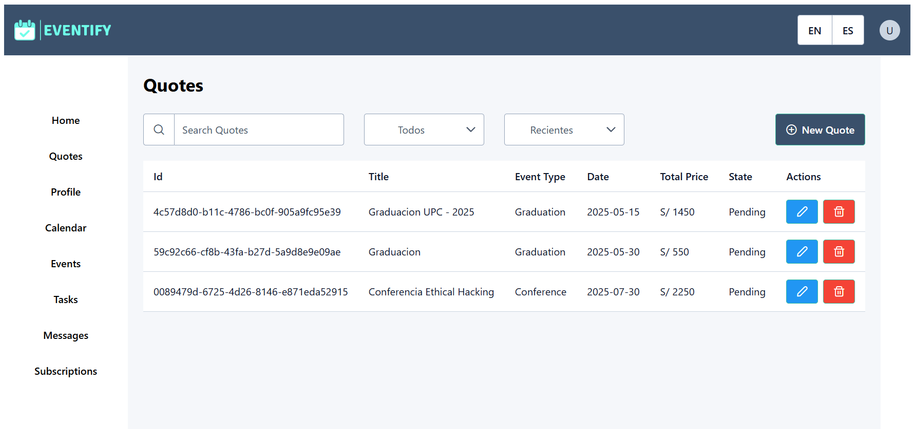

**Quote Order Form Component**

Este es el formulario donde se define información relevante respecto al posible evento que se vaya a realizar. El organizador podrá definir el tipo de evento que se planeará, la cantidad de invitados, asi como la fecha que se celebraria. Además se podrá agregar los servicios que incluirá en la planeación.

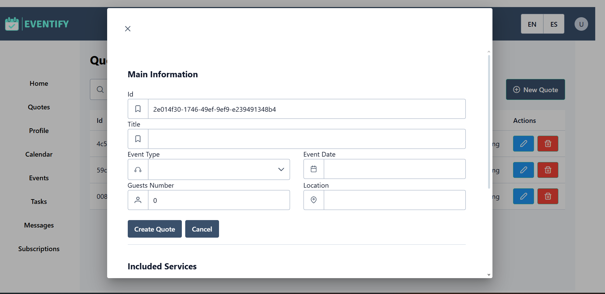

Una vez definido la información de la cotización, se registrará en el Fake API y se mostrará en la página **Quote Management**
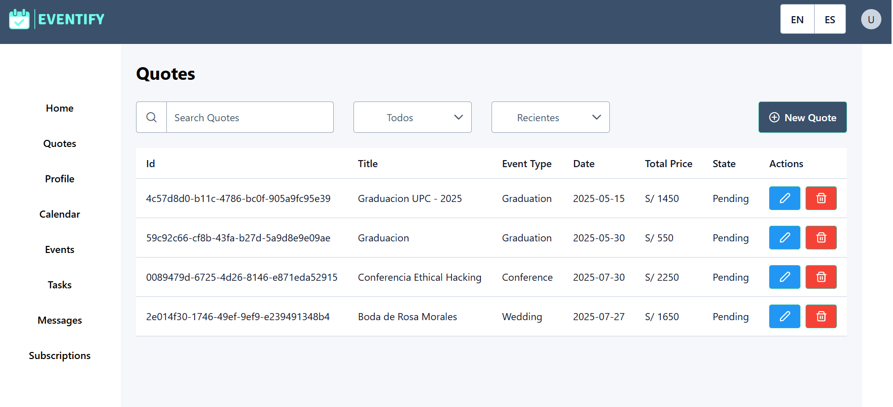


**Service Item Form Component**

Este es un formulario donde se define la información del servicio a incluir en la cotización, se redacta una breve descripción del servicio, se define la cantidad, el precio unitario y se calcula el precio total. Posteriormente, al crear el servicio, se registra en la tabla de Servicios Incluidos del formulario de cotizaciones
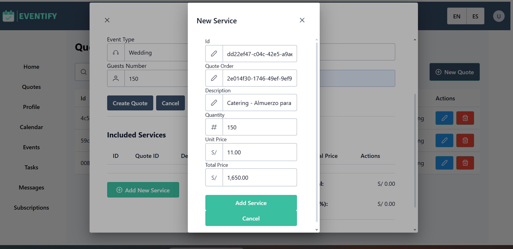

Una vez definido el servicio, se registrará en el Fake API y se mostrará en el formulario de Quote Order
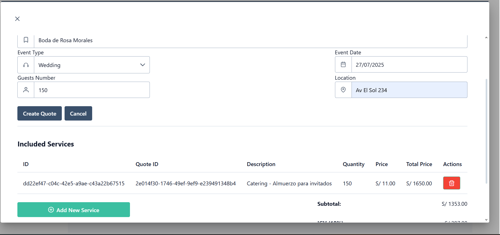


**Bounded Context Task Management**

**Task Management**

Esta es la página donde se visualiza el estado actual de la organizacion de las tareas del evento. Se puede crear tareas nuevas y asignarlas a un estado especifico, dependiendo del enfoque del organizador.
Con el objetivo de mantener al anfitrion de eventos siempre al tanto de las tareas que se están realizando, las que faltan por hacer, por revisar y completadas.

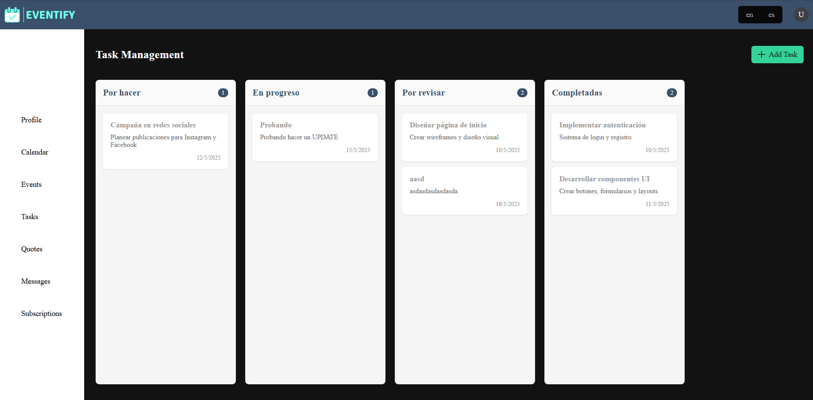

**Edit Task Component**

Este es un componente donde se podra editar una tarea, se podra cambiar el titulo, descripcion y columna a la que pertenece.

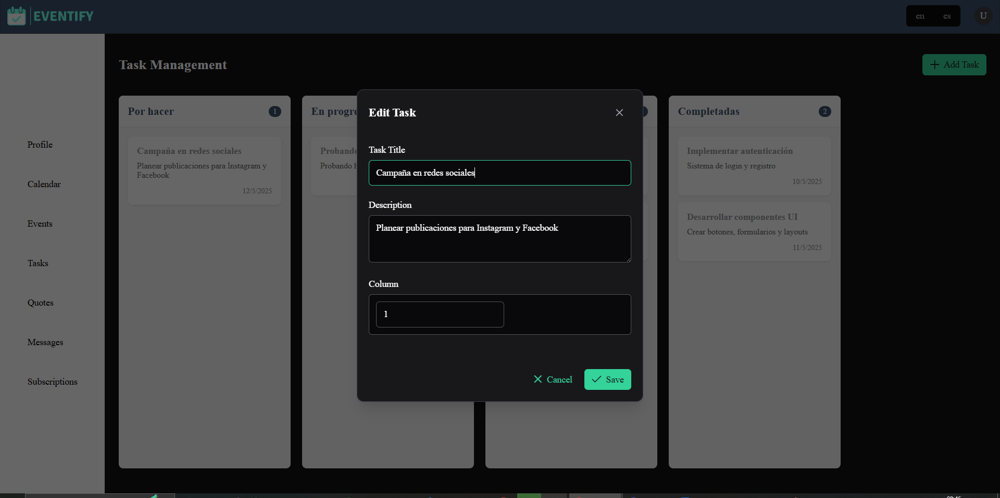


**Task Item Component**

Este componente contendra el titulo y descripcion de una tarea unitaria, asi como funciones de eliminar o editar, las cuales se actualizaran en el json.server.
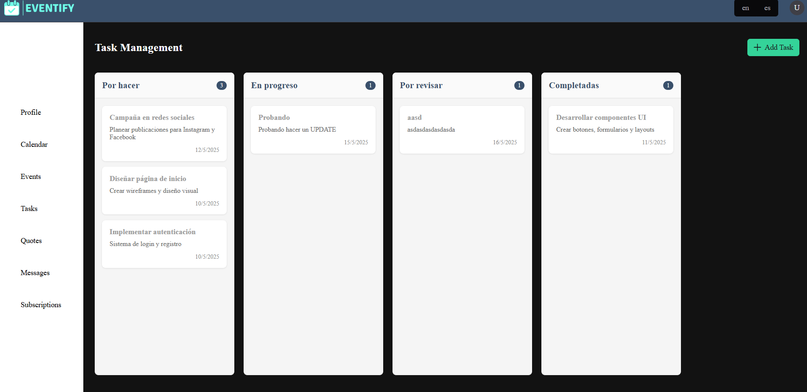

**Task Column Component**

En este componente se contendra el listado de tareas unitarias, existiran 4 columnas dependiendo del estado de los item tarea component. Asi como tambien un contador que evidenciara la cantidad de tareas con las que cuenta cada columna.
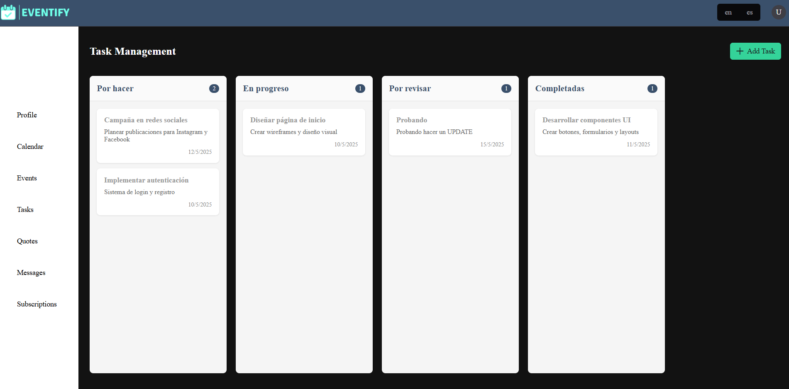

**Task Board Component**

Este componente contendra el listado de columnas, cada columna tendra un nombre y un contador que evidenciara la cantidad de tareas con las que cuenta cada columna. Este componente es el padre de los task column component.


#### 5.2.2.6.Services Documentation Evidence for Sprint Review.

Para este segundo Sprint, hemos realizado la implementación y el despliegue del FrontEnd de nuestra aplicación Web "Eventify"

<table> 
  <tr>
    <td> <strong>End Point </strong></td>
    <td align="center"> <strong>Funciones</strong> </td>
  </tr>

  <tr>
    <td> https://angeldevs-web.github.io/eventify-landing-page/</td>
    <td> Desplegar Landing Page de Eventify</td>
  </tr>
  <tr>
    <td> https://eventify-webapp-frontend.web.app</td>
    <td> Desplegar Front End</td>
  </tr>
  <tr>
    <td> https://eventify-frontend.free.beeceptor.com</td>
    <td> Desplegar Fake API</td>
  </tr>
</table>

#### 5.2.2.7.Software Deployment Evidence for Sprint Review.

Para el despliegue del FrontEnd utilizamos el servicio de hosting que ofrece Firebase. Para ello, hemos utilizado Firebase CLI para vincular nuestro proyecto con Firebase y mediante lineas de comandos realizar el despliegue.

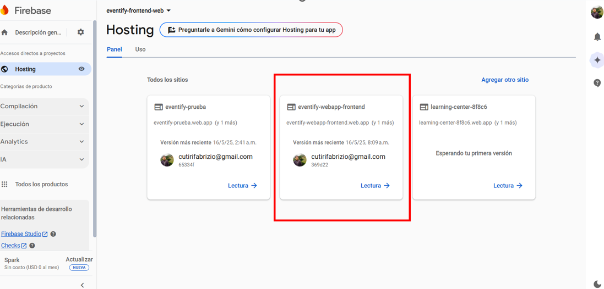
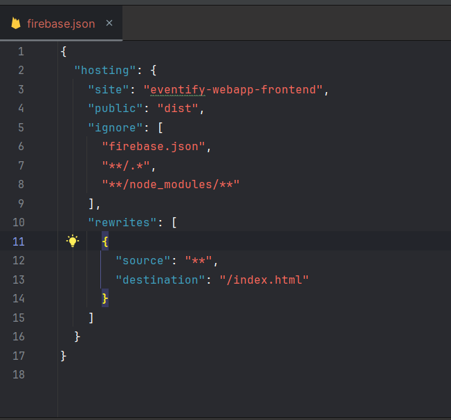

#### 5.2.2.8.Team Collaboration Insights during Sprint.

La meta para este Sprint fue la implementación y despliegue de la primera versión del FrontEnd de nuestro proyecto. Para ello, utilizamos diversas herramientas como GitHub, Webstorm, Vue 3, PrimeVue, PrimeFlex, Primeicons, entre otros.
Como evidencia de que se trabajo de forma colaborativa se presentan los insights del repositorio en Github donde se desarrollo el proyecto.

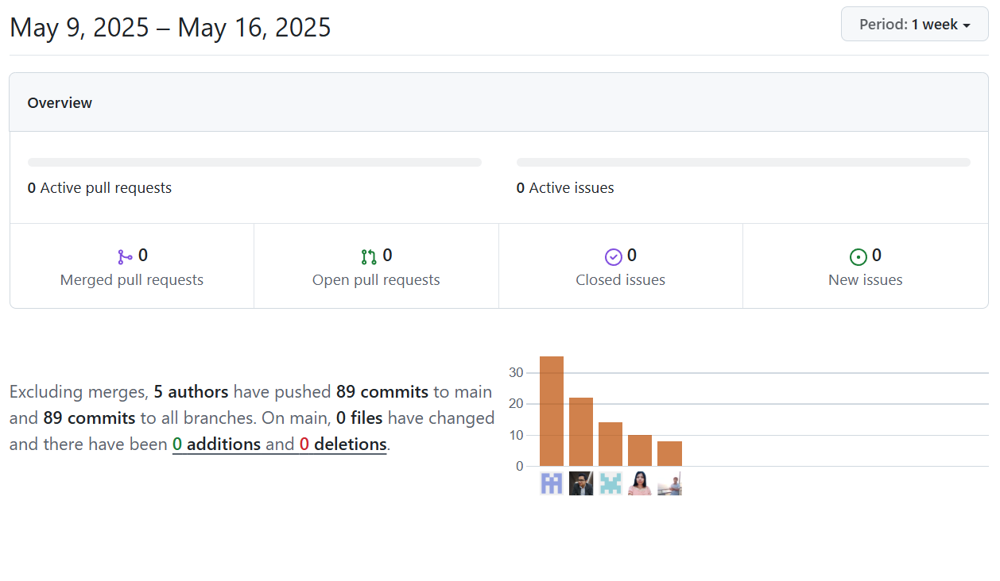

En esta imagen se muestran el total de commits que hizo cada integrante durante el desarrollo del Frontend

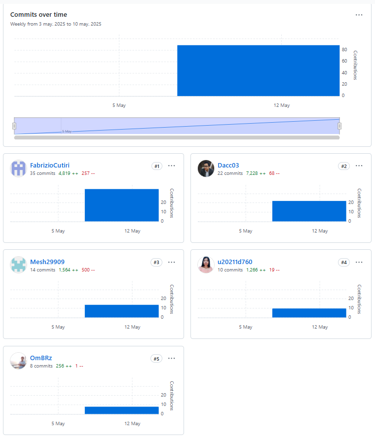

En esta imagen se refleja el nivel de modificaciones realizadas por los commits de cada integrante en el repositorio del FrontEnd.

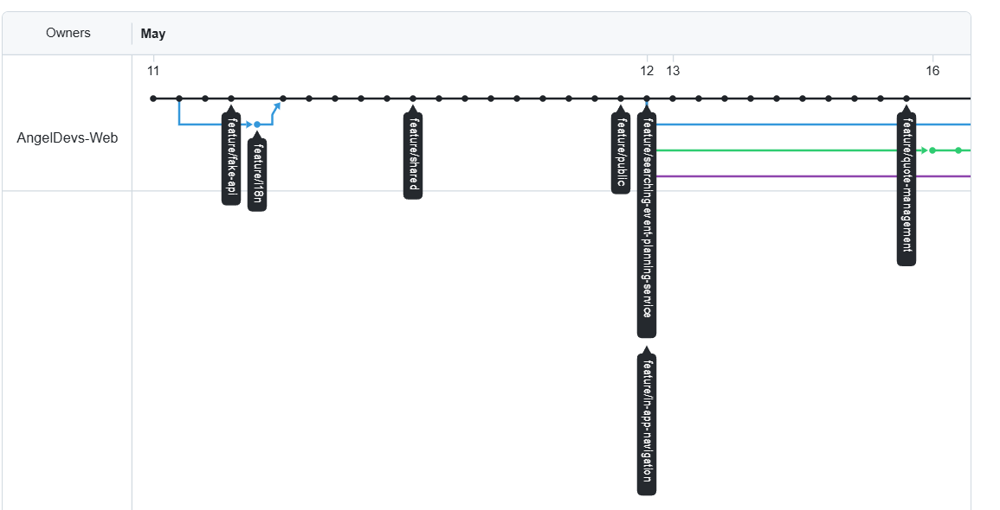

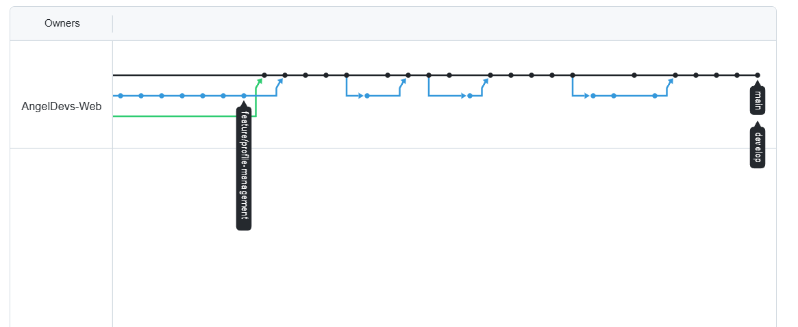

Finalmente en estas imagenes se pueden apreciar las ramas con las que se ha trabajado durante el desarrollo del FrontEnd